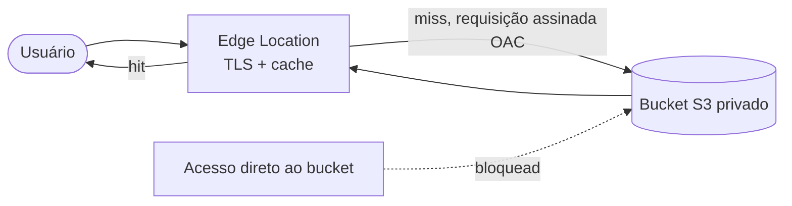

> [!abstract]
> CloudFront é a [[Content Delivery Network (CDN)]] da AWS: replica o conteúdo em pontos de presença próximos ao usuário, termina o TLS na borda e protege a origem de tráfego direto.

## Conceito

Em uma aplicação PWA, CloudFront é ao mesmo tempo **acelerador e fronteira de segurança**. Acelerador porque entrega o bundle a partir da borda; fronteira porque o bucket [[Amazon S3]] de hospedagem deixa de ser público — só a distribuição pode lê-lo, via **Origin Access Control (OAC)**, que assina cada requisição à origem com SigV4.

## Comportamentos de cache e o SPA

Uma aplicação de página única exige duas políticas opostas na mesma distribuição:

| Caminho | Política | Razão |
|---|---|---|
| `/assets/*` (JS, CSS com hash no nome) | Cache longo, imutável | O nome muda a cada build — o conteúdo nunca muda |
| `/index.html` | Cache curto ou nenhum | É o ponto de entrada que aponta para os assets novos |
| Rotas do cliente (`/dashboard`, `/settings`) | *Custom error response* 403/404 → `/index.html` com status 200 | O roteamento é do React Router; o S3 não conhece essas chaves |

Errar isso produz o sintoma clássico: deploy feito, usuário continua vendo a versão antiga, ou recebe 404 ao recarregar uma rota interna.

## Invalidação

`create-invalidation --paths "/*"` é o comando que encerra o deploy. É a operação que remove o conteúdo antigo das bordas antes do TTL natural expirar. As primeiras mil invalidações por mês são gratuitas — invalidar `/*` a cada deploy é prática aceitável e barata em pipelines de frequência normal.

## Características

- Camada gratuita permanente generosa: 1 TB de saída e 10 milhões de requisições por mês
- Tráfego **S3 → CloudFront não é cobrado**, o que torna a CDN mais barata que servir do bucket
- **CloudFront Functions** (JavaScript leve, sub-milissegundo, na borda) para reescrita de URL e cabeçalhos de segurança; **Lambda@Edge** quando é preciso mais tempo e acesso à rede
- Integra com AWS WAF, certificados ACM e cabeçalhos de resposta gerenciados (HSTS, CSP)

> [!tip] Não coloque a API atrás da mesma distribuição por padrão
> É possível, e às vezes desejável para evitar CORS. Mas mistura dois ciclos de cache muito diferentes e complica o diagnóstico. Enquanto a origem da API for [[Amazon API Gateway]] com CORS bem definido, mantenha as distribuições separadas.

## Veja também

- [[Content Delivery Network (CDN)]]
- [[Amazon S3]]
- [[Progressive Web App (PWA)]]
- [[Estratégias de Cache]]
