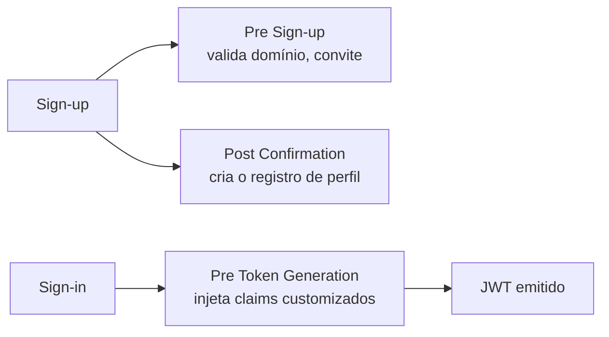

> [!abstract]
> Cognito é o provedor de identidade gerenciado da AWS: o **User Pool** autentica usuários e emite tokens JWT; o **Identity Pool** troca esses tokens por credenciais IAM temporárias para acesso direto a serviços AWS.

## Conceito

Cognito remove do produto a responsabilidade de guardar senha, implementar MFA, gerenciar fluxo de recuperação e girar chaves de assinatura. O que sobra para a aplicação é decidir **o que cada identidade pode fazer** — a [[Authorization]], não a [[Authentication]].

## User Pool × Identity Pool

| | **User Pool** | **Identity Pool** |
|---|---|---|
| Responde | *Quem é você?* | *A que recursos AWS você pode chegar?* |
| Entrega | `idToken`, `accessToken`, `refreshToken` ([[JSON Web Token (JWT)]]) | Credenciais IAM temporárias (STS) |
| Consumido por | [[Amazon API Gateway]] via JWT Authorizer | SDK da AWS no browser (upload direto a [[Amazon S3]], por exemplo) |
| Cobrança | Por usuário ativo no mês (MAU) | Sem custo |

Os dois se combinam: o User Pool autentica, o Identity Pool converte aquela prova em permissão de infraestrutura com escopo estreito.

## Os três tokens

| Token | Contém | Uso correto |
|---|---|---|
| `idToken` | Atributos do usuário (perfil) | Popular a UI. **Nunca** como credencial de API |
| `accessToken` | Escopos e claims de autorização | Cabeçalho `Authorization: Bearer` nas chamadas à API |
| `refreshToken` | Nada legível | Renovar a sessão sem novo login |

A validação do `accessToken` no gateway é feita contra o **JWKS público** do pool — sem chamada de rede ao Cognito no caminho da requisição.

## Triggers — o ponto de extensão

Cognito permite injetar Lambdas no ciclo de vida da identidade:

O trigger **Pre Token Generation** é o que viabiliza [[Multi-Tenancy]]: é ali que `tenantId`, papéis e status de onboarding entram no token — ver [[Token Enrichment (Custom Claims)]]. Sem ele, cada requisição precisaria de uma consulta extra ao banco só para descobrir a que organização o usuário pertence.

## Características

- Atributos personalizados (`custom:*`) são **imutáveis em tipo e tamanho** depois de criados — planeje antes do primeiro deploy
- MFA, política de senha, bloqueio adaptativo e recuperação de conta são configuração, não código
- Federação com SAML 2.0 e OIDC (Google, Microsoft Entra, Okta) — ver [[Identity Federation]]
- O `sub` do Cognito é o identificador da identidade; manter um `userId` interno próprio evita amarrar o modelo de domínio ao provedor

> [!warning] Migrar de provedor de identidade é caro
> Senhas não são exportáveis em texto claro. A troca de provedor exige migração progressiva no login ou reset em massa. Encapsular o SDK atrás de um adaptador único (um só arquivo importa a biblioteca do provedor) é o que mantém essa porta aberta.

## Veja também

- [[Token Enrichment (Custom Claims)]]
- [[Lambda Authorizer]]
- [[JSON Web Token (JWT)]]
- [[Multi-Tenancy]]
- [[OAuth 2.0]]
- [[Identity and Access Management (IAM)]]
