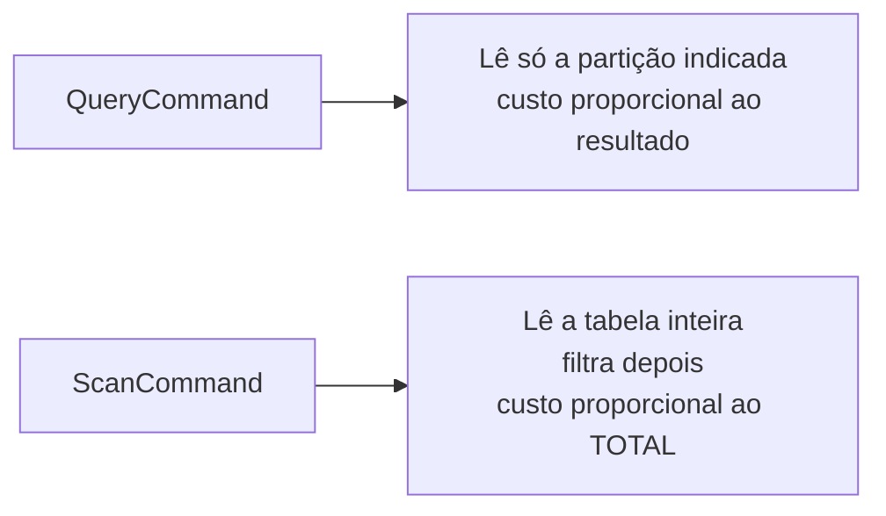

> [!abstract]
> DynamoDB é o banco NoSQL chave-valor e documento totalmente gerenciado da AWS: latência de milissegundos em qualquer volume, escala automática, sem servidor, sem VPC e sem pool de conexões.

## Conceito

DynamoDB é o par natural de [[AWS Lambda]] porque resolve o problema que mata bancos relacionais em ambientes serverless: **conexão**. Não há pool a esgotar, não há *handshake* a pagar no [[Cold Start]], não há sub-rede a configurar. O acesso é uma chamada HTTPS assinada por IAM.

O preço dessa simplicidade é a inversão do processo de modelagem. Em um banco relacional, modela-se a entidade e depois se escreve a consulta. Aqui, **parte-se dos padrões de acesso** e a tabela é desenhada para servi-los — ver [[Single-Table Design]].

## Modelo de dados

| Elemento | Papel |
|---|---|
| **Partition Key (PK)** | Determina a partição física. Define a distribuição da carga |
| **Sort Key (SK)** | Ordena os itens dentro da partição e habilita consultas por faixa (`begins_with`, `between`) |
| **Atributos** | Schemaless — itens da mesma tabela podem ter formatos diferentes |
| **GSI** | Índice secundário global: outra PK/SK, tabela virtual com custo próprio |
| **LSI** | Índice secundário local: mesma PK, outra SK. Só na criação da tabela |
| **TTL** | Atributo epoch que faz o item ser removido automaticamente — ideal para sessões, conexões e chaves de [[Idempotência]] |

## Query × Scan — a decisão que define o custo

> [!warning] `FilterExpression` não reduz custo
> O filtro é aplicado **depois** da leitura. Um `Scan` com filtro que retorna 10 itens de uma tabela de um milhão paga a leitura do milhão. Aceitável em fase inicial de produto; insustentável em escala. A correção é um GSI que transforme o padrão de acesso em `Query`.

## Consistência e transações

- Leitura **eventualmente consistente** por padrão (metade do custo); *strongly consistent* sob demanda, e nunca disponível em GSI
- `TransactWriteItems` garante atomicidade ACID sobre até **100 itens** e 4 MB, inclusive entre tabelas — com `ConditionExpression` para proteger invariantes de negócio
- Escrita condicional (`attribute_not_exists`) é o mecanismo de controle de concorrência otimista

## DynamoDB Streams

Cada tabela pode emitir um fluxo ordenado das alterações de item (`NEW_AND_OLD_IMAGES`), consumido por Lambda em lotes. É a implementação de [[Change Data Capture (CDC)]] neste ecossistema, e o que viabiliza o [[Outbox Pattern]] sem *dual write*: grava-se na tabela e o consumidor do stream publica o evento.

> [!warning] Laço infinito de trigger
> Escrever na **mesma tabela** de dentro do consumidor do seu próprio stream cria um ciclo que não termina. Escreva em outra tabela ou publique em [[Amazon EventBridge]].

## Limites que moldam a arquitetura

| Limite | Valor | Consequência de projeto |
|---|---|---|
| Tamanho do item | 400 KB | Anexos vão para [[Amazon S3]]; a tabela guarda a referência |
| Página de leitura | 1 MB | Paginação é obrigatória, não opcional |
| Transação | 100 itens / 4 MB | Agregados grandes precisam de [[Saga]] |
| Retenção do stream | 24 h | O consumidor precisa acompanhar; falha prolongada perde eventos |

## Veja também

- [[Single-Table Design]]
- [[Change Data Capture (CDC)]]
- [[Multi-Tenancy]]
- [[AWS Lambda]]
- [[Tipos de Banco de Dados]]
- [[Eventual Consistency]]
