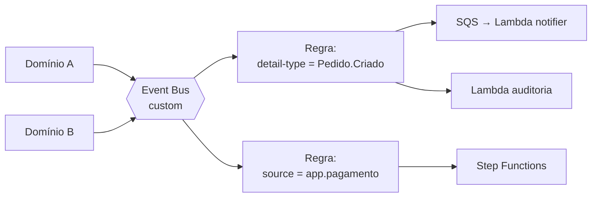

> [!abstract]
> EventBridge é o barramento de eventos gerenciado da AWS: um produtor publica um fato no barramento sem saber quem escuta, e regras baseadas no conteúdo do evento entregam a cópia a cada consumidor interessado.

## Conceito

É a implementação de [[Event Driven Architecture]] em que o **roteamento é declarativo**. O produtor não conhece o destino; a regra é que decide, casando um padrão contra o conteúdo do evento. Adicionar um novo consumidor é adicionar uma regra — nenhuma linha do produtor muda.

Essa é a diferença que importa em relação a chamar [[Amazon SQS]] diretamente: com a fila, o produtor precisa conhecer a URL do destino. Com o barramento, o acoplamento desaparece.

## Anatomia



| Elemento | Papel |
|---|---|
| **Bus** | Namespace do fluxo. Um barramento customizado por produto isola do `default` (eventos da própria AWS) |
| **Event** | Envelope JSON com `source`, `detail-type`, `time` e `detail` |
| **Rule** | Padrão de correspondência sobre o conteúdo — não sobre um tópico |
| **Target** | Destino da entrega: Lambda, SQS, SNS, Step Functions, outro barramento |
| **Schema Registry** | Catálogo versionado dos formatos publicados |
| **Archive / Replay** | Retenção dos eventos e reprocessamento de uma janela de tempo |

## Contrato de evento

Um barramento sem disciplina de contrato vira um acoplamento invisível: o consumidor passa a depender de campos que o produtor nunca prometeu. O antídoto é padronizar o envelope e registrá-lo:

```json
{
  "eventId":    "uuid-v4",
  "source":     "{produto}.{dominio}",
  "detailType": "{Entidade}.{Ação}",
  "entityId":   "uuid",
  "tenantId":   "uuid",
  "userId":     "uuid",
  "timestamp":  "ISO-8601",
  "metadata":   {}
}
```

O `eventId` cumpre um segundo papel: é a chave de [[Idempotência]] do consumidor. Consumidores assíncronos não recebem cabeçalhos HTTP, então a chave precisa viajar **dentro** do evento.

## Características

- Entrega **at-least-once** — o consumidor precisa ser idempotente, sem exceção
- Sem ordenação garantida entre eventos distintos
- Evento limitado a 256 KB, tarifado em blocos de 64 KB
- **Não há camada gratuita para eventos customizados**: cobra-se desde o primeiro
- *Archive* + *Replay* permitem reprocessar o passado quando um consumidor novo entra ou quando um bug corrompeu uma projeção

> [!important] EventBridge × SNS × SQS
> Não são substitutos. O padrão canônico usa os três em série: **EventBridge** roteia por conteúdo → **SQS** dá durabilidade, lote e DLQ ao consumidor → o handler processa. **SNS** entra quando o fan-out precisa de push para muitos assinantes heterogêneos ou notificação móvel.

## Veja também

- [[Event Driven Architecture]]
- [[Domain Events]]
- [[Amazon SQS]]
- [[Amazon SNS]]
- [[Outbox Pattern]]
- [[Idempotência]]
