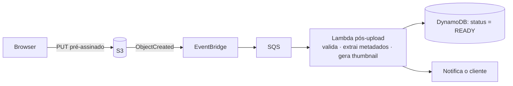

> [!abstract]
> S3 é o serviço de [[Object Storage]] da AWS: armazena objetos identificados por chave dentro de buckets, com durabilidade de onze noves, escala sem provisionamento e acesso por API HTTPS.

## Conceito

Em uma arquitetura serverless, S3 acumula quatro papéis distintos que convém não confundir:

| Papel | Conteúdo | Quem acessa |
|---|---|---|
| **Hospedagem do frontend** | Bundle estático do SPA/PWA | [[Amazon CloudFront]], via OAC — nunca o browser direto |
| **Uploads do usuário** | Arquivos enviados pela aplicação | O browser, via [[Pre-Signed URL]] |
| **Data lake analítico** | Exportações particionadas em Parquet | [[Amazon Athena]] |
| **Artefatos de build** | Saídas do pipeline | CI/CD |

## Chave não é diretório

S3 é um espaço de chaves plano. `tenant-a/2026/01/arquivo.pdf` é **uma chave**, não três pastas — o console apenas simula a hierarquia. Isso tem consequências reais:

- O **prefixo da chave é a unidade de isolamento e de particionamento**. Começar toda chave pelo `tenantId` é o que permite escrever uma política IAM que impede um tenant de ler o objeto de outro
- Listagem por prefixo é barata; varredura do bucket inteiro, não
- Em exportações analíticas, o prefixo `year=YYYY/month=MM/` é o que habilita *partition pruning* no Athena e derruba o custo por consulta

## Eventos

S3 emite notificações de criação, remoção e restauração de objeto, que podem ir direto para Lambda, SQS, SNS ou [[Amazon EventBridge]]. É o que fecha o ciclo do upload: o cliente envia direto ao bucket, o evento dispara o processamento, e a aplicação só é informada quando o arquivo já foi validado.

## Características

- **Consistência forte de leitura após escrita** para PUT, DELETE e listagem, desde 2020 — o antigo "eventual consistency do S3" não vale mais
- Classes de armazenamento (Standard, Infrequent Access, Glacier) com transição automática por *lifecycle policy*
- Versionamento por objeto, criptografia em repouso por padrão e *Object Lock* para retenção regulatória
- Bloqueio de acesso público habilitado por padrão — a exposição pública deve ser sempre exceção deliberada

> [!warning] Nunca exponha a URL do bucket ao usuário
> Além do risco de vazamento por política mal configurada, a transferência de saída do S3 para a internet é cobrada, enquanto **S3 → CloudFront é gratuita**. Todo download de usuário passa pela CDN.

## Veja também

- [[Object Storage]]
- [[Pre-Signed URL]]
- [[Amazon CloudFront]]
- [[Amazon Athena]]
- [[Data Lake]]
