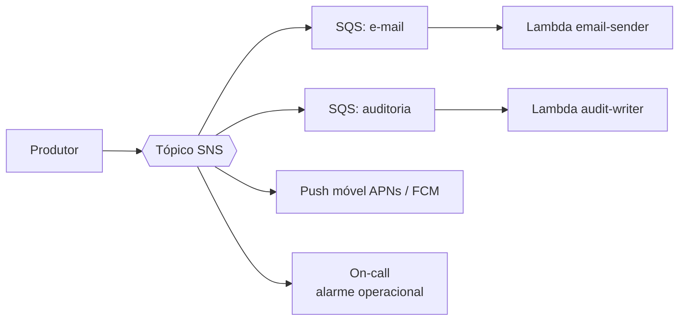

> [!abstract]
> SNS é o serviço de publicação e assinatura da AWS: uma mensagem publicada em um tópico é entregue simultaneamente a todos os assinantes — filas, funções, endpoints HTTP, e-mail e push móvel.

## Conceito

Enquanto [[Amazon SQS]] é *um produtor, um consumidor lógico*, SNS é **um produtor, N consumidores**. A mensagem é empurrada (push) para cada assinatura no momento da publicação; não há armazenamento aguardando leitura.

O padrão canônico é o **fan-out SNS → SQS**: o tópico entrega a cada fila, e cada consumidor lê da sua própria fila no seu próprio ritmo, com DLQ independente. Isso combina a difusão do pub/sub com a durabilidade da fila.

## Características

- **Filter policies** por assinatura: o filtro é avaliado no SNS, então o assinante só é acionado pelo que lhe interessa — sem custo de invocação descartada
- Entrega **at-least-once**, sem garantia de ordem em tópicos standard; tópicos FIFO existem, com as mesmas restrições da fila FIFO
- Entrega a APNs e FCM sem custo adicional de entrega — o caminho padrão para notificação móvel nativa
- Retentativa com backoff por protocolo, e DLQ por assinatura

## Comparação

| | **SNS** | **[[Amazon EventBridge]]** | **[[Amazon SQS]]** |
|---|---|---|---|
| Modelo | Pub/sub push | Barramento com roteamento por conteúdo | Fila pull |
| Seleção do destino | Assinatura no tópico | Regra sobre o corpo do evento | Endereçamento direto |
| Retenção | Nenhuma | Archive opcional | 1 min a 14 dias |
| Uso típico aqui | Alarmes operacionais, push móvel, fan-out amplo | Eventos de domínio entre contextos | Amortecer o consumidor |

> [!tip] Onde SNS realmente ganha
> Em uma arquitetura que já usa EventBridge para eventos de domínio, o papel restante do SNS é a **saída operacional**: alarmes do CloudWatch para o on-call e entrega de push nativo. Usar os dois para a mesma coisa duplica o roteamento sem ganho.

## Veja também

- [[Amazon SQS]]
- [[Amazon EventBridge]]
- [[Event Driven Architecture]]
- [[Web Push]]
- [[Amazon CloudWatch]]
