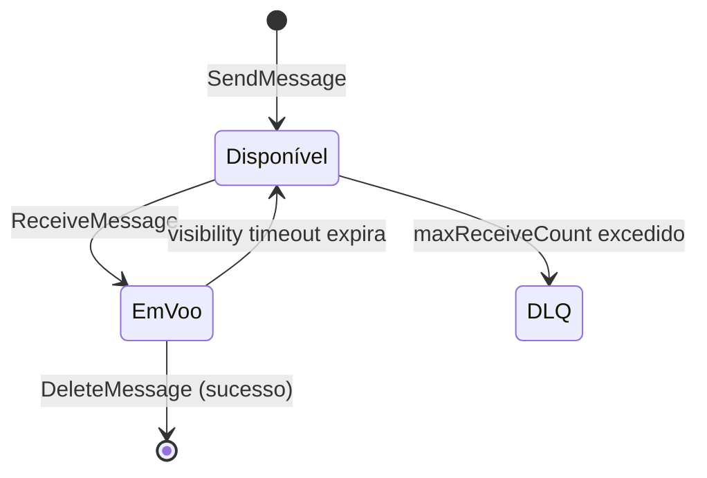

> [!abstract]
> SQS é a fila gerenciada da AWS: guarda a mensagem com durabilidade até que um consumidor a processe e a apague, absorvendo picos de carga e isolando o produtor da falha do consumidor.

## Conceito

É a implementação da [[Message Queue]] neste ecossistema, e o **amortecedor** do fluxo assíncrono. Entre [[Amazon EventBridge]] e a Lambda consumidora, a fila acrescenta três coisas que o barramento sozinho não dá: retenção durável quando o consumidor está fora do ar, consumo em lote, e a rede de segurança da *Dead Letter Queue*.

## Ciclo de vida da mensagem

O **visibility timeout** é o contrato temporal da fila: enquanto ele corre, a mensagem fica invisível para outros consumidores. Se o processamento não terminar (e não apagar a mensagem) a tempo, ela reaparece e é processada de novo — origem clássica de duplicação. A regra prática: `visibility timeout ≥ 6 × timeout da Lambda`.

## Standard × FIFO

| | **Standard** | **FIFO** |
|---|---|---|
| Ordem | Best-effort | Estrita, por *message group* |
| Entrega | At-least-once | Exactly-once dentro da janela de deduplicação |
| Vazão | Praticamente ilimitada | Limitada por grupo |
| Custo | Menor | Maior |

> [!warning] "Exactly-once" da FIFO não dispensa idempotência
> A garantia vale para a janela de deduplicação de 5 minutos, dentro do serviço. Retentativas do consumidor, reentrega após visibility timeout e replay continuam existindo. [[Idempotência]] é responsabilidade do handler.

## Dead Letter Queue

A DLQ é a fila para onde a mensagem vai depois de falhar `maxReceiveCount` vezes. Sem ela, uma mensagem venenosa é reprocessada indefinidamente, consome invocações e trava o lote atrás dela.

- Fila assíncrona **sem DLQ é falha silenciosa** — o erro desaparece sem rastro
- Alarme em `ApproximateNumberOfMessagesVisible > 0` na DLQ é o sinal de que algo entrou em degradação
- `bisectBatchOnError` isola o registro problemático dentro de um lote em vez de descartar o lote inteiro

## Características

- Mensagem de até 256 KB; payloads maiores vão para [[Amazon S3]] com a referência na mensagem
- Retenção configurável de 1 minuto a 14 dias
- *Long polling* reduz chamadas vazias e custo
- Integração nativa com Lambda por *event source mapping*, com lote de até 10.000 registros e janela de acumulação

## Veja também

- [[Message Queue]]
- [[Amazon EventBridge]]
- [[Amazon SNS]]
- [[Idempotência]]
- [[Retry Pattern]]
- [[Bulkhead]]
