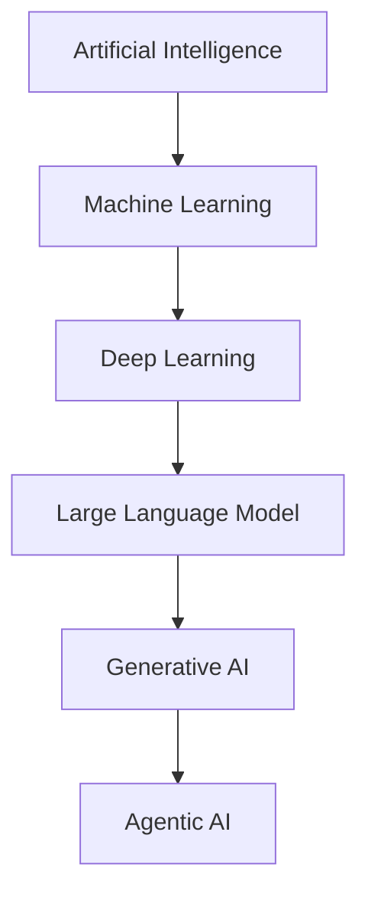

> [!abstract]
> Inteligência Artificial é o campo de sistemas capazes de executar tarefas que tradicionalmente exigiriam inteligência humana — reconhecer padrões, inferir, decidir e gerar.

## Conceito

Para efeito de gestão de produtos e serviços, o que importa não é a taxonomia técnica, mas a **natureza do erro**. Sistemas determinísticos falham de forma reproduzível; sistemas de IA falham de forma probabilística e plausível — produzem saídas erradas que parecem certas.

Isso muda o desenho do controle: validação por amostragem, supervisão humana proporcional ao risco e rastreabilidade da decisão passam a ser requisitos, não boas práticas.

## Estrutura

## Características

- Erro probabilístico e plausível, não reproduzível
- Desempenho depende de dados, que envelhecem
- Exige supervisão proporcional ao risco da decisão
- Classificada, no ITIL 5, pelo [[ITIL AI Capability Model]]

## Veja também

- [[Generative AI]]
- [[Agentic AI]]
- [[Large Language Model (LLM)]]
- [[ITIL AI Capability Model]]
- [[ITIL AI Governance]]
