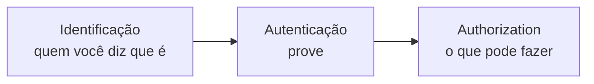

> [!abstract]
> Autenticação é o ato de **provar que a identidade declarada é verdadeira** — a segunda das três perguntas da gestão de identidade.

## Conceito

A sequência é sempre a mesma e confundir os passos é a origem de falhas graves:

Autenticar é comparar uma prova apresentada com uma referência guardada. O que muda entre os métodos é **qual é a prova** e quão difícil é forjá-la ou roubá-la.

## Os três fatores

| Fator | O que é | Exemplos |
|---|---|---|
| **Conhecimento** | Algo que você sabe | Senha, PIN, resposta secreta |
| **Posse** | Algo que você tem | Celular, token físico, chave de segurança |
| **Inerência** | Algo que você é | Digital, face, íris |

**MFA** é exigir provas de **fatores diferentes**. Senha mais pergunta secreta não é MFA — são dois fatores de conhecimento, sujeitos ao mesmo tipo de comprometimento.

## Evolução dos métodos

| Método | Fragilidade |
|---|---|
| Senha | Segredo compartilhado: vaza, é reutilizada, cai em phishing |
| Senha + SMS | O SMS é interceptável e vulnerável a *SIM swap* |
| Senha + TOTP | Melhor, mas ainda phishable — o código pode ser repassado ao atacante |
| **[[WebAuthn e Passkeys]]** | Resistente a phishing por construção: a chave é vinculada ao domínio |

> [!important] Autenticação forte não substitui autorização
> Provar quem é o usuário não diz nada sobre o que ele pode acessar. A falha mais comum em APIs — *Broken Object Level Authorization* — acontece em endpoints **corretamente autenticados**. Ver [[Authorization]] e [[Segurança de API]].

> [!warning]
> Em [[Zero Trust]], a autenticação deixa de ser um evento no início da sessão e passa a ser reavaliada continuamente, junto com a postura do dispositivo e o contexto da requisição.

## Fonte

- NIST, [SP 800-63B — Digital Identity Guidelines: Authentication and Lifecycle Management](https://pages.nist.gov/800-63-3/sp800-63b.html)
- OWASP, [Authentication Cheat Sheet](https://cheatsheetseries.owasp.org/cheatsheets/Authentication_Cheat_Sheet.html)

## Veja também

- [[Authorization]]
- [[Identity and Access Management (IAM)]]
- [[Single Sign-On (SSO)]]
- [[OpenID Connect]]
- [[WebAuthn e Passkeys]]
- [[Armazenamento Seguro de Senhas]]
- [[Zero Trust]]
