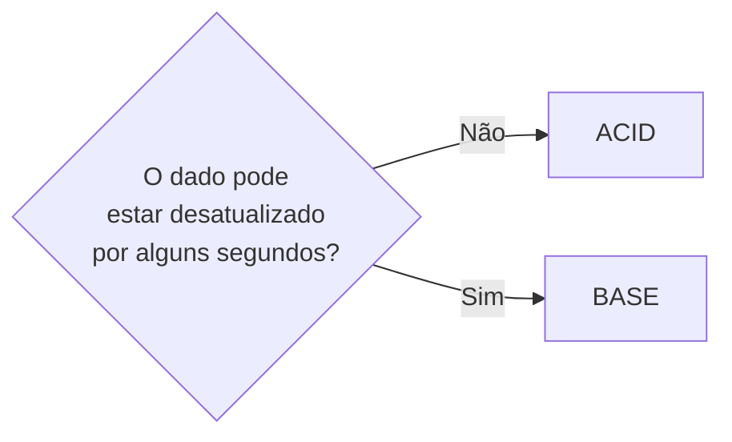

> [!abstract]
> BASE é o conjunto de garantias relaxadas adotado por bancos NoSQL — **Basically Available, Soft state, Eventually consistent** — para quem considera [[ACID]] estrito demais.

## Conceito

O modelo ACID dos bancos relacionais é rígido por desenho: prefere falhar a devolver algo inconsistente. Em sistemas distribuídos de larga escala, essa rigidez custa disponibilidade — e para muitos domínios esse é o trade-off errado.

BASE faz a escolha oposta: **prefere disponibilidade a consistência**, afirmando que os estados convergirão com o tempo.

| Letra | Significado |
|---|---|
| **Basically Available** | O sistema responde a toda requisição, mesmo que com dado desatualizado ou parcial |
| **Soft state** | O estado pode mudar sem entrada nova, à medida que a replicação propaga |
| **Eventually consistent** | Sem novas escritas, todas as réplicas acabam convergindo. Ver [[Eventual Consistency]] |

## Comparação

| | **ACID** | **BASE** |
|---|---|---|
| Prioridade | Consistência | Disponibilidade |
| Comportamento sob falha | Falha a operação | Responde com o que tem |
| Típico de | Bancos relacionais | Bancos NoSQL distribuídos |
| Bom para | Dinheiro, estoque, contrato | Catálogo, feed, telemetria, carrinho |

> [!important] A escolha é por caso de uso, não por sistema
> A mesma aplicação normalmente precisa dos dois. O saldo da conta exige [[ACID]]; o contador de visualizações do produto tolera BASE tranquilamente. Tratar a decisão como "somos um time SQL" ou "somos um time NoSQL" é o erro que gera os dois piores resultados possíveis — inconsistência onde ela custa caro, ou indisponibilidade onde ninguém precisava dela.

> [!warning] Sobre categorizar bancos por CAP
> O próprio arquivo ByteByteGo registra a crítica: o [[CAP Theorem]] é estreito demais para classificar bancos como "CP" ou "AP". Partições de rede são garantidas em sistemas distribuídos e precisam ser tratadas de qualquer forma — a referência é *Please stop calling databases CP or AP*, de Martin Kleppmann.

## Fonte

- ByteByteGo, *CAP, BASE, SOLID, KISS, What do these acronyms mean?* — BIG ARCHIVE: System Design 2023

## Veja também

- [[ACID]]
- [[CAP Theorem]]
- [[Eventual Consistency]]
- [[Tipos de Banco de Dados]]
- [[Saga]]
- [[System Design MOC]]
