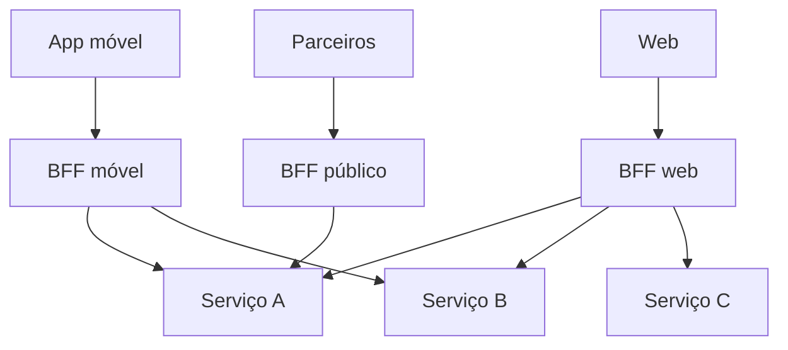

> [!abstract]
> Backend for Frontend é o padrão de criar **um backend dedicado por experiência de usuário** — um para o app móvel, outro para a web — em vez de um backend genérico que serve a todos mal.

## Conceito

Uma API única para todos os clientes enfrenta necessidades contraditórias. O app móvel precisa de poucas chamadas e payload enxuto, porque a rede é cara e instável; a web tolera mais chamadas e quer mais dados por tela. Atender aos dois em um só contrato produz *over-fetching* para um e *under-fetching* para o outro.

O BFF resolve dando a cada experiência o seu próprio agregador, mantido **pelo mesmo time** que constrói aquele frontend.

## Por que não é só mais um gateway

| | **[[API Gateway]]** | **BFF** |
|---|---|---|
| Quantidade | Um, compartilhado | Um por experiência |
| Responsabilidade | Políticas transversais: identidade, roteamento, [[Rate Limiting]] | Agregação e formatação **para aquele cliente** |
| Dono | Time de plataforma | Time do frontend correspondente |
| Contém regra de negócio? | Não deve | Alguma orquestração, sim |

Os dois convivem: o gateway na borda aplica a política; o BFF atrás dele monta a resposta.

> [!important] O ganho real é organizacional
> O BFF elimina a fila entre o time de frontend e o time de backend. Quem precisa do campo novo na tela consegue adicioná-lo sem negociar prioridade com outro time — aplicação direta da [[Lei de Conway]], desenhando o software conforme a fronteira de comunicação desejada.

> [!warning]
> O custo é **duplicação**. Três BFFs significam três lugares onde a mesma orquestração pode divergir. O padrão só compensa quando as experiências têm necessidades genuinamente diferentes; com dois clientes que consomem quase a mesma coisa, [[GraphQL]] costuma resolver melhor — o cliente escolhe os campos e não há backend extra para manter.

## Fonte

- Sam Newman, [Pattern: Backends For Frontends](https://samnewman.io/patterns/architectural/bff/) e *Building Microservices*, O'Reilly

## Veja também

- [[API Gateway]]
- [[Microservices]]
- [[GraphQL]]
- [[Lei de Conway]]
- [[Estilos de Arquitetura de API]]
- [[System Design MOC]]
