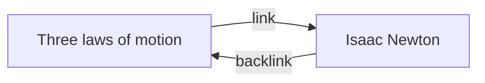

> [!abstract]
> **Backlink** é o link de entrada de uma nota: se a nota A contém um link para B, então B tem um backlink apontando para A — a mesma aresta lida na direção oposta.

## Conceito

O [[Internal Link (Wikilink)]] é escrito manualmente e aponta para fora. O backlink não é escrito por ninguém: é **derivado** do índice de links do [[Metadata Cache]] e mostrado pelo core plugin Backlinks. Essa assimetria é o que dá valor à rede — você escreve N links e ganha N caminhos de volta de graça.

A doc formula a utilidade com uma imagem direta: backlinks servem para encontrar as notas que referenciam a nota que você está escrevendo — *imagine se você pudesse listar os backlinks de qualquer site da internet*.

## Estrutura / Fluxo

## Características

- O painel Backlinks fica no sidebar direito e mostra os backlinks da **aba ativa**, atualizando ao trocar de nota.
- Duas seções colapsáveis:
  - **Linked mentions** — notas que contêm um internal link para a nota ativa.
  - **Unlinked mentions** — ocorrências não linkadas do nome da nota ativa. Ver [[Unlinked Mention]].
- Opções do painel: **Collapse results** (expandir ou não cada nota), **Show more context** (truncar ou mostrar o parágrafo inteiro), **Change sort order**, **Show search filter** — o filtro usa a gramática de [[Search Syntax (Obsidian)]].
- Comando **Backlinks: Show backlinks** reexibe a aba se ela sumiu.
- Comando **Backlinks: Open backlinks for the current note** abre uma aba *linkada*, presa a uma nota específica, com ícone de elo — ela não segue a navegação.
- Comando **Backlinks: Toggle backlinks in document** mostra os backlinks no rodapé da própria nota; a opção **Backlink in document** faz isso automaticamente a cada nota aberta.
- Arquivos que casam com os padrões de **Excluded files** não aparecem em Unlinked mentions.
- Em [[Base (Obsidian Bases)]], `file.hasLink(this.file)` numa base de sidebar replica o painel de backlinks; a property `file.backlinks` existe, mas é performance-heavy.

> [!tip]
> Um backlink em card de texto de [[Canvas]] só existe depois de **Convert to file...** — cards text-only não aparecem em Backlinks.

## Comparação

| | Backlink (incoming) | Outgoing link |
|---|---|---|
| Origem | Derivado do índice | Escrito por você na nota |
| Painel | Backlinks | Outgoing links |
| Pergunta | Quem cita esta nota? | O que esta nota cita? |
| Seções | Linked mentions · Unlinked mentions | Links · Unlinked mentions |
| Controle | Nenhum direto | Total |

## Veja também

- [[Internal Link (Wikilink)]]
- [[Unlinked Mention]]
- [[Graph View]]
- [[Search Syntax (Obsidian)]]
- [[Knowledge Graph]]
- [[Diagnóstico do Grafo de Conhecimento]]
