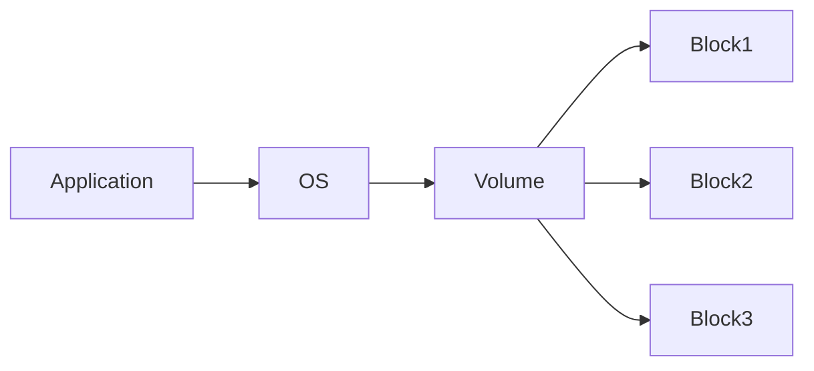

Block Storage armazena dados em blocos independentes, que podem ser acessados diretamente pelo sistema operacional como discos.

Cada bloco possui um endereço único, permitindo acesso de baixa latência e alto desempenho.

> [!info]
> O sistema operacional é responsável por organizar os blocos em arquivos por meio de um sistema de arquivos.

## Características

- Baixa latência
- Alto desempenho
- Elevado número de IOPS
- Acesso aleatório eficiente

## Casos de uso

- Bancos de dados
- Sistemas transacionais
- Máquinas virtuais
- Containers

## Exemplos

- Amazon EBS
- Azure Managed Disks
- Google Persistent Disk

## Vantagens

- Alto desempenho
- Consistência
- Ideal para workloads críticos

## Limitações

- Não é compartilhado por padrão
- Escalabilidade menor que Object Storage

## Veja também

- [[Storage]]
- [[File Storage]]
- [[Object Storage]]