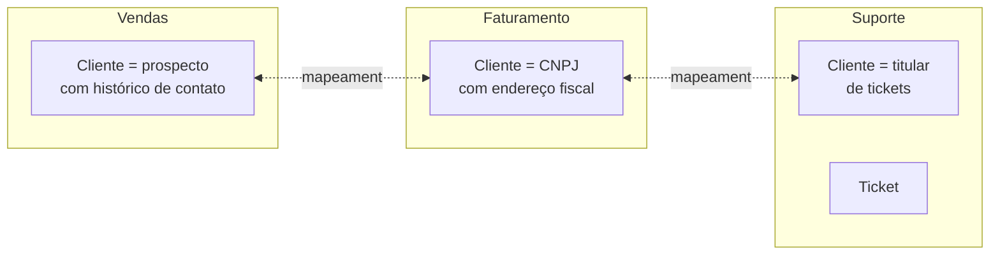

> [!abstract]
> Bounded Context é a fronteira dentro da qual um modelo de domínio é **internamente consistente** — o padrão central do design estratégico de [[Domain Driven Design]].

## Conceito

DDD projeta software a partir de modelos do domínio, e o modelo funciona como linguagem ubíqua entre desenvolvedores e especialistas. Para ser eficaz, ele precisa ser **unificado**: internamente consistente, sem contradições.

O problema aparece com a escala. Grupos diferentes de uma organização grande usam vocabulários sutilmente diferentes, e a precisão exigida pelo software esbarra nisso — normalmente nos conceitos centrais do domínio.

> [!quote] O exemplo de Fowler
> Numa distribuidora de energia, a palavra "medidor" significava coisas sutilmente diferentes em partes distintas da empresa: a conexão entre a rede e um local, a conexão entre a rede e um cliente, ou o aparelho físico que pode ser trocado se defeituoso. Esses **polissemas** se resolvem na conversa, mas não no mundo preciso dos computadores. O mesmo recorre com "Cliente" e "Produto".

A conclusão de Evans é explícita: "a unificação total do modelo de domínio de um sistema grande não será viável nem custo-efetiva". DDD então divide o domínio em contextos, cada um com o seu modelo unificado.

## Como se manifesta

Contextos têm conceitos **exclusivos** — um ticket de suporte só existe no contexto de suporte — e conceitos **compartilhados**, como produto e cliente, que podem ter modelos completamente diferentes, com mecanismos de mapeamento para integração.

## O que desenha a fronteira

> [!important] Cultura humana, antes de tecnologia
> O fator dominante é a **linguagem**: onde o vocabulário muda, o modelo precisa mudar. Isso torna a fronteira de contexto uma consequência de como as pessoas se organizam e falam — a mesma força descrita pela [[Lei de Conway]], e o motivo de contextos serem os melhores candidatos a fronteira de [[Microservices]].

O **context map** é a representação das relações entre contextos, e é onde ficam explícitos os padrões de integração — ACL, Shared Kernel, Customer-Supplier.

## Fonte

- Martin Fowler, [Bounded Context](https://martinfowler.com/bliki/BoundedContext.html), 2014
- Eric Evans, *Domain-Driven Design*, parte IV — Strategic Design, Addison-Wesley

## Veja também

- [[Domain Driven Design]]
- [[Microservices]]
- [[Lei de Conway]]
- [[Domain Events]]
- [[CQRS]]
- [[Strangler Fig]]
- [[Team Topologies]]
