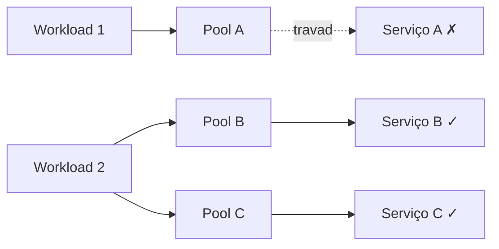

> [!abstract]
> Bulkhead isola os elementos de uma aplicação em compartimentos estanques, de modo que a falha de um não se propague aos demais.

## Conceito

O nome vem das anteparas que dividem o casco de um navio: se o casco é rompido, apenas a seção danificada se enche de água, e o navio não afunda.

O problema que o padrão ataca é o **esgotamento de recursos**. Quando um consumidor chama um serviço que não responde, os recursos usados naquela chamada — tipicamente o pool de conexões — ficam presos. Se as requisições continuam, o pool esvazia, e a partir daí o consumidor não consegue mais falar com **nenhum** serviço, não só com o que travou.

Com pools separados por destino, o serviço A falhando afeta apenas o pool A. As cargas que usam B e C continuam funcionando.

## Formas de particionar

| Nível | Mecanismo |
|---|---|
| **Consumidor** | Pools de conexão, thread pools, semáforos, processos separados |
| **Serviço** | Instâncias separadas por grupo de consumidores, VMs, contêineres |
| **Mensageria** | Filas distintas, cada uma com seu conjunto de instâncias consumidoras |
| **Cluster** | Requests/limits de CPU e memória por Pod em [[Kubernetes (K8s)]] |

## Benefícios

- Isola consumidores e serviços de **falhas em cascata**
- Preserva funcionalidade parcial: outros recursos da aplicação seguem operando
- Permite **níveis de serviço distintos** — um pool de alta prioridade servido por instâncias de alta prioridade

## Quando usar

Use quando for preciso isolar recursos por dependência, separar consumidores críticos dos comuns, ou proteger a aplicação de falha em cascata.

> [!warning] Não use quando
> O uso menos eficiente de recursos for inaceitável, ou quando a complexidade adicional não se justificar. Compartimentar sempre custa capacidade ociosa.

> [!tip]
> As fronteiras dos compartimentos devem seguir os requisitos de negócio. Em [[Domain Driven Design]], alinhá-las aos *bounded contexts* é a escolha natural. Contêineres oferecem bom equilíbrio entre isolamento e sobrecarga.
>
> Prefira controles nativos da plataforma — limites de recurso no [[Kubernetes (K8s)]], políticas de taxa no [[API Gateway]] — em vez de recriar isolamento no código da aplicação.

## Fonte

- Microsoft, [Bulkhead pattern](https://learn.microsoft.com/en-us/azure/architecture/patterns/bulkhead), Azure Architecture Center
- Michael Nygard, *Release It!*, Pragmatic Bookshelf

## Veja também

- [[Circuit Breaker]]
- [[Retry Pattern]]
- [[Rate Limiting]]
- [[Timeout]]
- [[Microservices]]
- [[Kubernetes (K8s)]]
- [[System Design MOC]]
