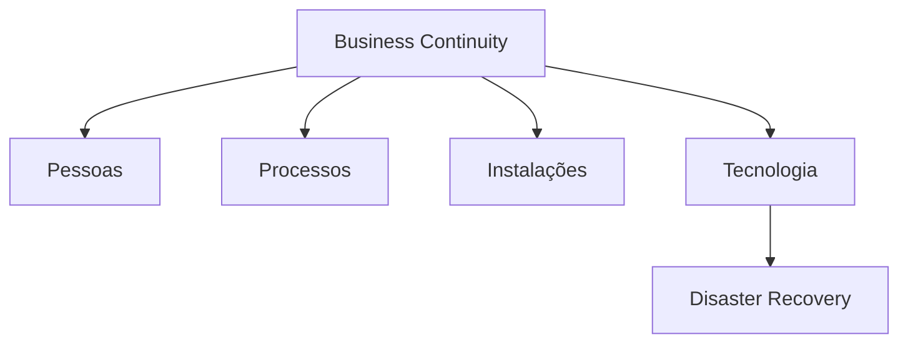

Business Continuity (BC) é a capacidade de uma organização manter suas operações essenciais durante e após eventos adversos.

Enquanto o [[Disaster Recovery]] trata da recuperação da tecnologia, Business Continuity abrange pessoas, processos, instalações e tecnologia.

> [!tip]
> Disaster Recovery é um subconjunto da estratégia de Business Continuity.

## Objetivos

- Manter serviços essenciais
- Reduzir impacto financeiro
- Preservar a confiança dos clientes
- Atender requisitos regulatórios

## Componentes

- Gestão de riscos
- Plano de continuidade
- Plano de comunicação
- Disaster Recovery
- Testes periódicos

## Exemplos

- Operação em múltiplas regiões
- Equipes distribuídas
- Infraestrutura redundante
- Backup dos dados

## Veja também

- [[Disaster Recovery]]
- [[Backup]]
- [[High Availability]]
- [[Risk Management]]