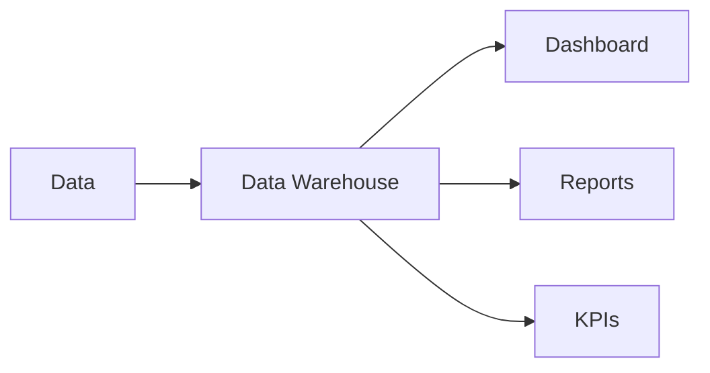

Business Intelligence (BI) é o conjunto de processos, ferramentas e técnicas utilizados para transformar dados em informações que apoiam a tomada de decisão.

> [!info]
> BI concentra-se em responder perguntas sobre o desempenho do negócio utilizando dados históricos e atuais.

## Componentes

- Dashboards
- KPIs
- Relatórios
- OLAP

## Ferramentas

- Power BI
- Tableau
- Amazon QuickSight
- Looker

## Veja também

- [[Data Warehouse]]
- [[Data Lake]]
- [[ETL]]
- [[Analytics]]