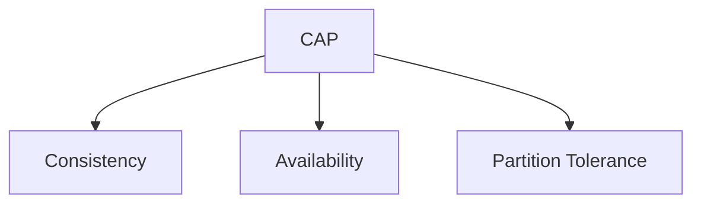

O Teorema CAP afirma que um sistema distribuído pode garantir, no máximo, duas das seguintes propriedades:

- Consistency
- Availability
- Partition Tolerance

> [!warning]
> Em presença de falhas de rede (Partition), é necessário escolher entre Consistency ou Availability.

## Exemplos

CP

- MongoDB (configuração específica)
- ZooKeeper

AP

- Cassandra
- DynamoDB

## Veja também

- [[Database Sharding]]
- [[Distributed Cache]]
- [[System Design MOC]]
- [[Distributed Systems]]
- [[Eventual Consistency]]
- [[Consensus]]