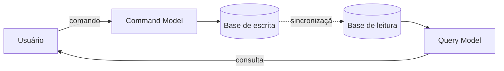

> [!abstract]
> CQRS é a ideia de usar **um modelo para atualizar** a informação e **outro para lê-la**, em vez de um único modelo conceitual que atende aos dois usos.

## Conceito

A abordagem dominante trata o sistema como um repositório CRUD: um modelo de registro que se cria, lê, atualiza e apaga. Conforme o domínio fica sofisticado, esse modelo único começa a servir mal aos dois lados — regras de validação complexas na escrita, agregações e combinações de registros na leitura.

CQRS separa o modelo conceitual em dois, seguindo o vocabulário de *Command Query Separation*: o **Command model** trata das atualizações; o **Query model**, das leituras.

Os dois modelos costumam ser objetos distintos, em processos lógicos separados, às vezes em hardware separado. Podem compartilhar o mesmo banco — que então serve de canal entre eles — ou usar bancos distintos, caso em que o lado de leitura vira efetivamente uma *reporting database*.

## Quando compensa

Fowler aponta dois ganhos concretos:

1. **Domínios complexos** onde comando e consulta divergem tanto que um modelo único fica ruim para os dois. *Minoria dos casos.*
2. **Alto desempenho com assimetria entre leitura e escrita**, permitindo escalar e otimizar cada lado de forma independente.

> [!warning] O alerta é do próprio autor
> "You should be very cautious about using CQRS." Fowler afirma que, entre os casos que encontrou, a maioria **não** foi bem-sucedida — CQRS aparece como força significativa para colocar sistemas em séria dificuldade. Deve ser aplicado a **partes específicas** do sistema (um [[Domain Driven Design|bounded context]]), nunca ao sistema inteiro.

> [!tip] Alternativa mais barata
> Se o problema é apenas consulta pesada, uma *reporting database* resolve: o sistema principal continua atendendo a maioria das consultas e só as mais exigentes são descarregadas. CQRS usa modelo separado para **todas** as consultas.

## Relação com eventos

CQRS não é sobre eventos — dá para usá-lo sem nenhum evento no desenho. Mas combina bem: quando o lado de escrita gera eventos para toda atualização, o lado de leitura pode ser construído a partir deles. Modelos separados também levantam a questão de quão consistentes precisam ficar entre si, o que costuma levar a [[Eventual Consistency]].

> [!important] A confusão que arruína projetos
> CQRS e [[Event Sourcing]] são patrocinados juntos com tanta frequência que viram sinônimos na cabeça das equipes. Fowler relata um projeto declarado "desastre de event sourcing" cujo custo real — atualizar dois modelos a cada mudança — era CQRS. Diagnosticar o culpado é impossível quando os padrões estão fundidos.

## Fonte

- Martin Fowler, [CQRS](https://martinfowler.com/bliki/CQRS.html), 2011
- Martin Fowler, [What do you mean by "Event-Driven"?](https://martinfowler.com/articles/201701-event-driven.html), 2017

## Veja também

- [[Event Sourcing]]
- [[Event Driven Architecture]]
- [[Domain Events]]
- [[Eventual Consistency]]
- [[Domain Driven Design]]
- [[System Design MOC]]
