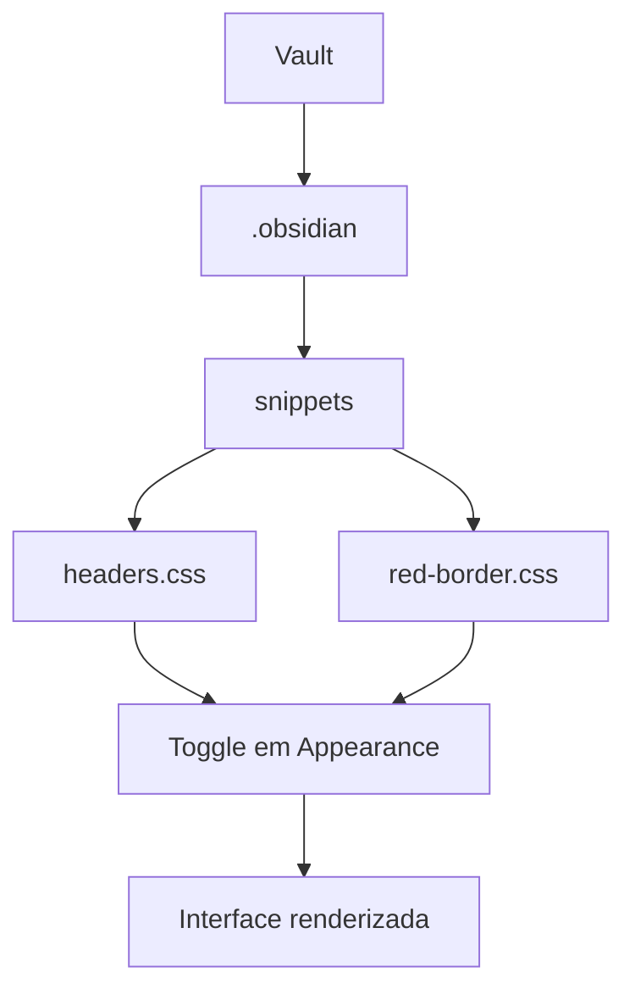

> [!abstract]
> Um **CSS snippet** é um arquivo `.css` avulso colocado em `<vault>/.obsidian/snippets/` que altera partes da aparência do Obsidian sem exigir a construção de um theme completo.

## Conceito

O snippet existe para o caso em que você quer mudar *uma coisa* — a cor dos headings, a borda das imagens de certas notas — e não a identidade visual inteira do app. A doc o apresenta explicitamente como a alternativa a "build a theme".

A diferença estrutural em relação ao [[Theme (Obsidian)]] é de cardinalidade: **vários snippets podem estar ativos ao mesmo tempo**, cada um com seu toggle, enquanto o theme é um só. Isso faz do snippet uma camada aditiva sobre o theme, não um substituto dele.

O Obsidian procura os snippets dentro da [[Configuration Folder|configuration folder]] do vault, o que significa que eles viajam com o vault quando você o copia ou sincroniza.

## Estrutura



## Sintaxe

Duas vias suportadas. A primeira são as **CSS variables** do Obsidian — o exemplo literal da doc é um arquivo `headers.css`:

```css
body {
  --h1-color: red;
  --h2-color: orange;
  --h3-color: yellow;
  --h4-color: green;
  --h5-color: blue;
  --h6-color: pink;
}
```

A segunda é a property `cssclasses`, **o único mecanismo de escopo por nota**:

```css
.red-border img {
   border-color: #ff0000;
   border-style: solid;
}
```

```yaml
cssclasses:
 - red-border
```

Toda nota que contiver `red-border` em `cssclasses` exibe imagens com borda vermelha. Ver [[Properties (Frontmatter)]].

## Características

- **Desktop**: Settings → Appearance → CSS snippets → `Open snippets folder`, criar o `.css`, `Reload snippets`, ativar o toggle
- **Mobile/Tablet**: localizar o vault pelo gerenciador de arquivos, criar a pasta `snippets` se não existir, colocar o arquivo, e então `Reload snippets` + toggle nas Settings
- **Hot reload**: uma vez habilitado, o Obsidian detecta a alteração e a aplica ao salvar o arquivo — não é preciso reiniciar; pode ser necessário o comando *Reload Obsidian without saving* para ver mudanças no theme ou na nota atual
- CSS inválido simplesmente **não funciona** — a doc recomenda validar com um serviço como o CSS Validation Service do W3C
- Snippets também servem para customizar [[Callout|callouts]] por meio do atributo `data-callout`

> [!warning] Não existe loja nem revisão de segurança para snippets
> A doc de segurança para times é explícita: *"We do not have a community store for CSS snippets."* Eles vêm da Obsidian Community ou de repositórios GitHub públicos — sem scorecard, sem scanning automático, ao contrário de plugins e themes.

> [!info] Bundling de assets
> Snippets e themes precisam empacotar seus assets. A única exceção documentada é o Google Fonts, mantida para preservar performance no mobile.

## Comparação

| | CSS Snippet | [[Theme (Obsidian)]] |
|---|---|---|
| Quantidade ativa | **Vários simultâneos** | **Um de cada vez** |
| Origem | Arquivo `.css` que você mesmo põe na pasta | Community directory, `Install and use` |
| Local | `.obsidian/snippets/` | `.obsidian/themes` |
| Revisão de segurança | Nenhuma — não há loja | Scanning automático do diretório |
| Escopo | Global, ou por nota via `cssclasses` | Global |
| Atualização | Manual, no arquivo | `Check for updates` — não é automática |

## Veja também

- [[Theme (Obsidian)]]
- [[Configuration Folder]]
- [[Properties (Frontmatter)]]
- [[Callout]]
- [[Criar um CSS Snippet]]
