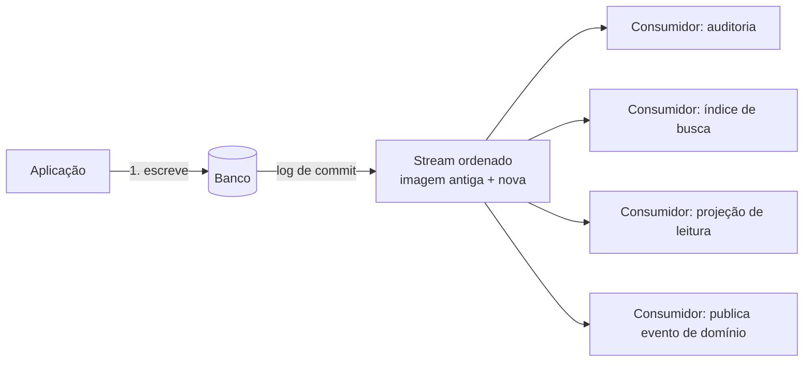

> [!abstract]
> Change Data Capture é o padrão que transforma as alterações de um banco de dados em um fluxo ordenado de eventos, permitindo que outros sistemas reajam ao que mudou sem consultar a fonte.

## Conceito

Sem CDC, manter dois sistemas sincronizados exige uma de duas coisas ruins: *polling* periódico (que atrasa, desperdiça leitura e ainda perde mudanças intermediárias) ou **dual write** — a aplicação escreve no banco e publica o evento. O dual write é o problema: as duas escritas não são atômicas, e a falha entre elas produz estados divergentes que ninguém detecta.

CDC resolve derivando o evento **do próprio log de commit** do banco. Se o dado foi gravado, o evento existe. Não há janela entre uma coisa e outra.

## Para que serve

| Uso | O que o consumidor faz |
|---|---|
| Trilha de auditoria imutável | Grava a transição (antes → depois) em armazenamento append-only |
| Sincronizar índice de busca | Reflete a alteração no motor de busca |
| Projeção de leitura ([[CQRS]]) | Materializa a visão desnormalizada que a tela consome |
| Invalidação de cache | Remove a entrada obsoleta do [[Distributed Cache]] |
| [[Outbox Pattern]] sem tabela de outbox | Publica o evento de domínio em [[Amazon EventBridge]] após a escrita confirmada |
| Exportação analítica | Alimenta o [[Data Lake]] em formato colunar |

## Propriedades que o consumidor precisa respeitar

- **At-least-once**: o mesmo registro pode chegar duas vezes. O consumidor é obrigatoriamente idempotente — ver [[Idempotência]]
- **Ordem local, não global**: a ordem é garantida por partição/chave, não entre chaves distintas
- **Retenção limitada**: o stream tem janela finita (24 h no DynamoDB Streams). Um consumidor parado por mais tempo que isso perde eventos e precisa de reconciliação por varredura completa
- **A mudança de schema viaja no stream**: o consumidor precisa tolerar itens com formatos de gerações diferentes

> [!warning] Ciclo de realimentação
> Um consumidor que escreve de volta na tabela que ele mesmo observa gera um novo evento, que o aciona de novo, indefinidamente. Escreva em outra tabela, ou publique em um barramento.

## Implementações

| Tecnologia | Mecanismo |
|---|---|
| [[Amazon DynamoDB]] | DynamoDB Streams (`NEW_AND_OLD_IMAGES`) → Lambda |
| PostgreSQL | Replicação lógica / WAL, consumida por Debezium |
| MySQL | Binlog |
| MongoDB | Change Streams |

## Veja também

- [[Outbox Pattern]]
- [[Event Driven Architecture]]
- [[CQRS]]
- [[Event Sourcing]]
- [[Data Pipeline]]
- [[Eventual Consistency]]
