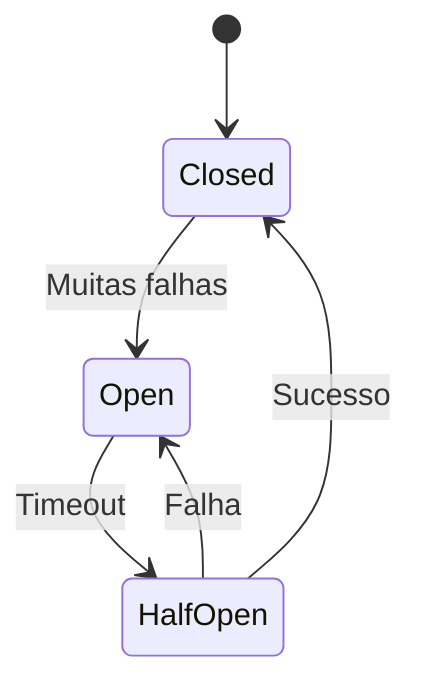

Circuit Breaker é um padrão de resiliência que interrompe chamadas para um serviço quando ele apresenta falhas repetidas.

Seu objetivo é evitar o efeito cascata.

> [!warning]
> Um Circuit Breaker evita que recursos sejam desperdiçados tentando acessar serviços indisponíveis.

## Estados

- Closed
- Open
- Half-Open

## Benefícios

- Resiliência
- Recuperação automática
- Proteção contra falhas em cascata

## Tecnologias

- Resilience4j
- Hystrix (descontinuado)
- Envoy
- Istio

## Veja também

- [[Microservices]]
- [[Message Queue]]
- [[System Design MOC]]
- [[Retry Pattern]]
- [[Bulkhead]]
- [[Timeout]]
- [[Service Mesh]]