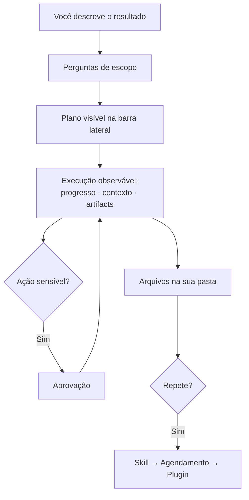

> [!abstract]
> **Claude Cowork** é a superfície do Claude dedicada ao trabalho delegado: você descreve um resultado multi-etapa e o Claude planeja, executa e devolve o entregável — com acesso a pastas locais, ferramentas conectadas e execução agendada.

## Conceito

Cowork é a materialização de [[Agentic Workflow]] no app desktop do Claude. A diferença concreta em relação ao Chat está no **destino do arquivo**: o Chat lê o que você envia e devolve download; o Cowork aponta para uma pasta sua, lê o que está lá e **salva o trabalho de volta no mesmo lugar**. Ver [[Work in a Folder]].

Uma distinção que a documentação de casos de uso torna precisa: **a capacidade é do modelo; a escala é da superfície**. Ler uma imagem em alta resolução ou raciocinar sobre fontes conflitantes é propriedade do modelo — você teria a mesma qualidade em alguns uploads no chat. O Cowork é o que torna isso praticável sobre a *pasta inteira*, com os documentos de referência ao lado, e agendável.

## Capacidades

| Capacidade | O que faz |
|---|---|
| **[[Work in a Folder\|Acesso a pasta local]]** | Lê e escreve na pasta que você seleciona; a pasta é a unidade de permissão |
| **[[Plano Revisável\|Plano revisável]]** | Faz as perguntas de escopo e expõe a sequência antes de executar |
| **[[Observabilidade de Sessão Agêntica\|Painéis da sessão]]** | Progresso, contexto (fontes lidas) e artifacts (arquivos criados), em tempo real |
| **[[Scheduled Task\|Tarefas agendadas]]** | Executa em cadência definida; se o app estava fechado, recupera depois |
| **Subagentes** | Divide um trabalho grande entre workers paralelos com contexto próprio — ver [[Agentes Paralelos]] |
| **Sessões paralelas** | Outra tarefa sua roda ao lado; ponto cinza avisa quando uma precisa de atenção |
| **Projetos** | Agrupa tarefas relacionadas num workspace com arquivos, instruções e memória — ver [[Project Workspace]] |
| **[[Connector\|Conectores]]** | Reúne contexto de mensageria, CRM, tracker e provedores de dado sem pré-coleta |
| **Uso de navegador** | Navega sites e extrai o número por trás do gráfico, não só o rótulo |
| **[[Computer Use]]** | Opera o computador quando não existe conector (research preview) |
| **[[Continuidade de Contexto entre Superfícies\|Handoff para add-ins]]** | A conversa segue para o Claude no Excel e no Word sem reexplicar o caso |
| **[[Plugin (AI Agent)\|Plugins]]** | Pacotes de skills, conectores e agentes por tipo de trabalho |

## Características

- **Orientado a entregável** — a saída é um arquivo no seu disco, em formato nativo, não texto no chat
- **Observável** — plano visível, fontes consultadas, progresso acompanhável, conduzível no meio
- **Com pontos de parada** — pede aprovação nas ações irreversíveis
- **Local por desenho** — o processamento acontece na máquina; o conteúdo não é enviado a lugar nenhum
- **Programável no tempo** — a tarefa recorrente é cidadã de primeira classe
- **Escalável em degraus** — a conversa que funcionou vira skill, a skill vira agendamento, o agendamento vira plugin

## Comparação

| | Chat | Cowork | [[Claude Code]] |
|---|---|---|---|
| Insumo | O que você anexa | A pasta que você concede | O repositório |
| Quem sequencia | Você | O agente | O agente |
| Saída | Resposta e download | Arquivo na pasta de origem | Commit, teste, build |
| Repetição | Manual | Skill, agendamento, plugin | Pipeline |

## Práticas associadas

- [[Auditoria de Pasta contra Regras]] — confrontar uma coleção contra um documento normativo
- [[Síntese Multi-Fonte]] — o padrão que nenhuma fonte mostra sozinha
- [[Especificação de Entregável]] — declarar o que volta, e em que forma
- [[Da Conversa à Skill e ao Agendamento]] — a escada de maturação
- [[Escolha do Modelo para a Tarefa]] — densidade do insumo × acabamento da saída

## Veja também

- [[Agentic Workflow]]
- [[Claude Code]]
- [[Escolha da Forma de Trabalho com IA]]
- [[Agent Skill]]
- [[Connector]]
- [[Claude Cowork Use Cases]]
