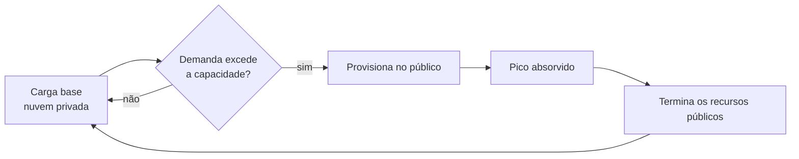

> [!abstract]
> Padrão de arquitetura híbrida em que a carga base roda na nuvem privada e os picos são temporariamente absorvidos por recursos da nuvem pública.

## Conceito

Resolve a contradição central de uma nuvem privada: dimensioná-la para o pico significa desperdiçar capacidade a maior parte do tempo; dimensioná-la para a média significa falhar no pico.

O bursting quebra o dilema — a capacidade privada cobre a base estável, e o público cobre o excedente sob demanda, sendo terminado depois.

## Características

Pré-requisitos que costumam ser subestimados:

- **Aplicação portável** — o mesmo artefato precisa rodar nos dois lados. É o argumento mais forte a favor de containers.
- **Rede consistente** entre os ambientes, com banda e latência medidas continuamente.
- **Consistência de dado** — o volume que os pods usam no privado precisa existir no público, sincronizado.
- **Automação de desprovisionamento** — se os recursos públicos não morrem sozinhos, o padrão vira só custo.

> [!warning] Não serve para tudo
> Bursting é adequado a workloads que **toleram latência maior** durante o pico e não exigem escala instantânea. Carga sensível a latência sofre com o salto de rede entre nuvens.

## Veja também

- [[Hybrid Cloud]]
- [[Kubernetes Federation]]
- [[Multi-Cloud]]
- [[Capacity Planning]]
