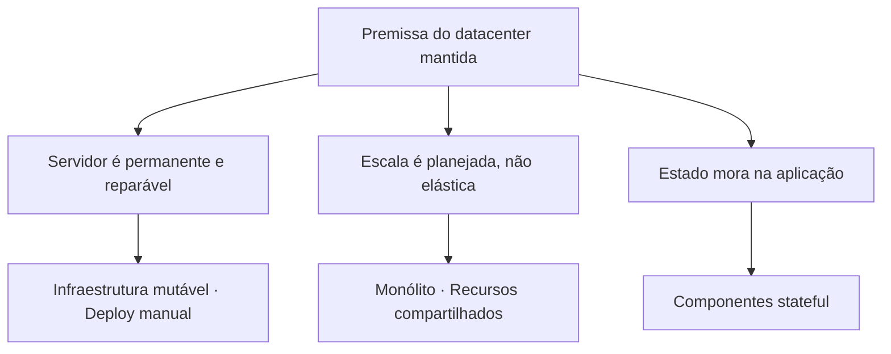

> [!abstract]
> Cloud Native Anti-Patterns são as práticas que mantêm as premissas do datacenter tradicional dentro de um ambiente de nuvem, anulando os ganhos de escala, resiliência e custo que motivaram a migração.

## Conceito

Quase todo anti-padrão da lista tem a mesma raiz: **o padrão antigo sobreviveu à mudança de ambiente**. A infraestrutura mudou, o modelo mental não. O resultado típico é um sistema que custa mais que o anterior e escala pior.

## Os nove anti-padrões

| # | Anti-padrão | Consequência |
|---|---|---|
| 1 | **Arquitetura monolítica** | Uma aplicação grande e fortemente acoplada rodando na nuvem — bloqueia escalabilidade e agilidade |
| 2 | **Ignorar otimização de custo** | Serviços de nuvem são caros; sem gestão ativa, o orçamento estoura |
| 3 | **Infraestrutura mutável** | Alterar componentes no lugar gera *configuration drift*, mais manutenção e menos confiabilidade |
| 4 | **Acesso ineficiente ao banco** | Consultas complexas demais ou falta de índice criam gargalo no ponto menos elástico da arquitetura |
| 5 | **Contêineres e imagens inchados** | Deploy lento, mais recursos consumidos, escala retardada justamente no pico |
| 6 | **Ignorar pipelines de CI/CD** | Implantação manual e propensa a erro reduz velocidade e frequência de release |
| 7 | **Dependência de recursos compartilhados** | Banco único compartilhado entre aplicações cria contenção e gargalo |
| 8 | **Muitos serviços de nuvem sem estratégia** | O catálogo do provedor é vasto; adotar sem critério gera complexidade ingerenciável |
| 9 | **Componentes com estado** | Estado persistente na aplicação impede escala horizontal e limita tolerância a falhas |

## Leitura transversal

> [!tip]
> Os anti-padrões 3, 5, 6 e 9 são os de correção mais direta: [[Immutable Infrastructure]] resolve o 3, imagens enxutas o 5, [[Pipeline de CI-CD]] o 6, e externalizar estado em [[Distributed Cache]] ou banco gerenciado o 9. Os anti-padrões 1, 7 e 8 são decisões de arquitetura e de governança, com prazo de correção muito maior.

## Veja também

- [[Cloud Native]]
- [[Adoção Cloud Native]]
- [[Immutable Infrastructure]]
- [[Microservices]]
- [[Cost]]
- [[Container]]
