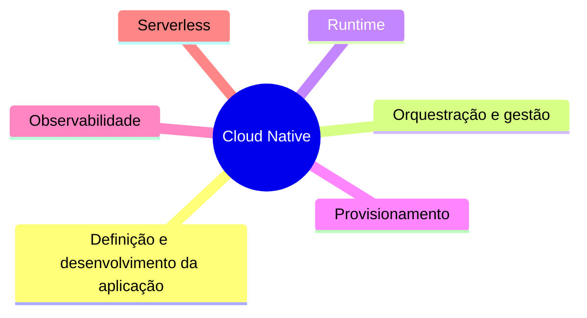

> [!abstract]
> Cloud Native é a abordagem de construir e operar aplicações que exploram as propriedades da nuvem — elasticidade, descartabilidade e automação — em vez de apenas hospedar nela o que foi desenhado para o datacenter.

## Conceito

Migrar uma aplicação para a nuvem não a torna cloud native; é o *lift and shift*, e ele frequentemente sai mais caro do que o ponto de partida. O que caracteriza cloud native é o **conjunto de premissas invertidas**: a infraestrutura é descartável e não reparável, a instância é efêmera e não permanente, a escala é automática e não planejada, e o estado vive fora da aplicação.

## O espectro de adoção

Adoção acontece em seis eixos, que evoluem em ritmos diferentes:

| Eixo | Do que trata |
|---|---|
| **Definição e desenvolvimento** | Como a aplicação é escrita, empacotada e versionada |
| **Orquestração e gestão** | [[Container Orchestration]], service mesh, descoberta |
| **Runtime** | Execução de contêineres, rede e armazenamento |
| **Provisionamento** | [[Infrastructure as Code]], automação e políticas |
| **Observabilidade** | [[Logging]], [[Distributed Tracing]], métricas e alertas |
| **[[Serverless]]** | Execução sem gestão de servidor, cobrada por uso |

> [!important] Não existe stack definitiva
> A pergunta "qual a stack cloud native correta?" não tem resposta única. A tecnologia deixou de ser o fator limitante — a maioria das organizações consegue operar com quase qualquer combinação madura. O tempo gasto escolhendo a stack perfeita rende menos do que o mesmo tempo gasto entendendo o cliente.

## Veja também

- [[Cloud Native Anti-Patterns]]
- [[Adoção Cloud Native]]
- [[Container]]
- [[Kubernetes (K8s)]]
- [[Microservices]]
- [[Immutable Infrastructure]]
- [[Serverless]]
- [[DevOps]]
- [[Platform Engineering]]
