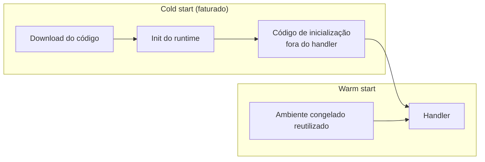

> [!abstract]
> Cold start é a latência adicional da primeira invocação em um ambiente de execução novo, quando a plataforma precisa provisionar o sandbox, carregar o código e inicializar o runtime antes de rodar o handler.

## Conceito

É o preço estrutural do modelo [[Serverless]]: não pagar por capacidade ociosa significa que, às vezes, a capacidade não está lá quando a requisição chega. Não é um defeito a eliminar — é um trade-off a dimensionar.

A fase de *init* roda **uma vez por ambiente**, não por requisição. Tudo que é caro e reaproveitável deve morar ali: cliente do SDK, conexão, parsing de configuração, leitura de segredo. Tudo que depende do evento fica no handler.

## O que aumenta

| Fator | Efeito |
|---|---|
| Tamanho do artefato | Mais bytes para baixar e descompactar |
| Runtime | Linguagens com máquina virtual e carregamento dinâmico pesam mais que binários nativos |
| Imports desnecessários no topo do arquivo | O runtime resolve tudo antes do primeiro byte útil |
| **VPC com ENI** | Historicamente o maior agravante; muito reduzido pelas ENIs compartilhadas, mas ainda não gratuito |
| Memória baixa | Menos CPU alocada — a própria inicialização fica mais lenta |

## O que reduz

- **Empacotamento enxuto**: *bundling* com tree-shaking, importando só o cliente do SDK que a função usa, não o SDK inteiro
- **Evitar VPC quando o serviço não exige** — [[Amazon DynamoDB]], S3, SQS e EventBridge são acessíveis sem rede privada
- **Provisioned concurrency** para o caminho crítico: mantém ambientes pré-inicializados e elimina o cold start, ao custo de capacidade paga por hora — deixa de ser puramente pay-per-use
- **SnapStart** (onde disponível): tira um snapshot do ambiente já inicializado e o restaura
- Aumentar memória: contraintuitivo, mas frequentemente **reduz custo total** ao encurtar duração

> [!warning] "Aquecer" a função com ping periódico é remendo
> A chamada agendada mantém *um* ambiente vivo. No primeiro pico de concorrência, todos os outros ambientes nascem frios do mesmo jeito — e agora com custo de invocação recorrente. Se a latência de cauda importa de verdade, o instrumento correto é provisioned concurrency.

## Onde realmente dói

Cold start é irrelevante em consumidores assíncronos (SQS, Streams, EventBridge): ninguém está esperando. Ele importa no caminho síncrono do usuário, e ainda assim afeta a **cauda** da distribuição — o p99, não a mediana. Antes de otimizar, meça quanto da latência percebida vem daí.

## Veja também

- [[Serverless]]
- [[AWS Lambda]]
- [[Latency Numbers]]
