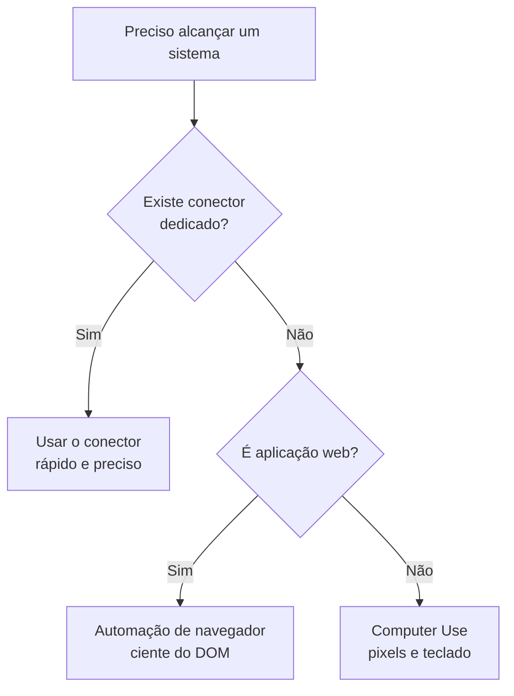

> [!abstract]
> **Computer Use** é a capacidade de um agente operar diretamente a interface gráfica de um computador ou navegador — clicando, digitando, abrindo aplicações — para alcançar sistemas que não expõem API nem [[Connector|conector]].

## Conceito

Todo mecanismo de integração de IA pressupõe uma interface programática. Quando ela não existe — um ERP antigo, um painel interno, um CRM sem API, um site sem endpoint — sobra a interface feita para humanos.

Computer Use é o **último recurso na hierarquia de integração**, e deve ser lido assim:

Cada degrau é mais lento, mais frágil e mais amplo em cobertura que o anterior.

## Características

- **Cobertura universal** — se um humano consegue operar, o agente também consegue tentar
- **Frágil** — depende de layout visual; mudança de interface quebra o fluxo
- **Lento** — screenshot, decisão e clique por passo
- **Alto risco** — a ação acontece no ambiente real do usuário, com as credenciais dele já abertas

## Salvaguardas

Por operar com a identidade do usuário sobre sistemas reais, o desenho responsável exige:

- **Permissão por aplicação**, concedida explicitamente antes do acesso
- **Lista de bloqueio** para o que é proibido
- **Aprovação humana** antes de ações irreversíveis — compra, envio, publicação, exclusão
- **Categorias vetadas por padrão** — serviços financeiros, por exemplo

> [!warning] Conteúdo observado é dado, não instrução
> Um agente que lê telas e páginas pode encontrar texto redigido para manipulá-lo (*prompt injection*). O princípio de defesa é categórico: instrução válida vem do usuário; tudo que o agente **vê** é dado a ser avaliado, nunca comando a ser obedecido.

## Veja também

- [[Connector]]
- [[Model Context Protocol (MCP)]]
- [[Agentic Workflow]]
- [[Human-in-the-Loop]]
- [[Threat Modeling]]
