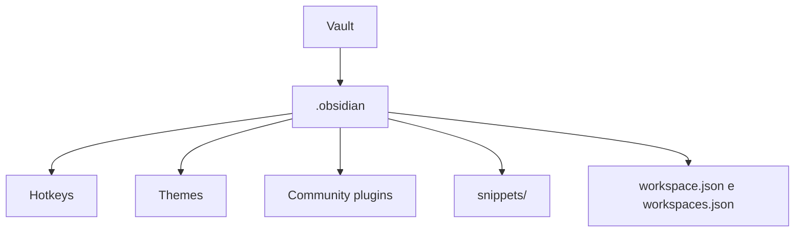

> [!abstract]
> A **configuration folder** é a pasta — por padrão `.obsidian`, na raiz do [[Vault]] — que guarda todos os arquivos de configuração daquele vault específico.

## Conceito

O Obsidian tem dois níveis de configuração, e confundi-los é a origem de boa parte das dúvidas de migração. O que é **por vault** vive dentro do próprio vault, em `.obsidian`, e viaja junto quando você copia a pasta. O que é **por instalação** vive numa system folder do sistema operacional, fora de qualquer vault.

Como `.obsidian` está dentro do vault, ela é versionável, sincronizável e copiável — é o que torna a configuração um artefato de conhecimento e não um estado preso ao aplicativo, coerente com o [[Local-first]].

## Estrutura

## Características

- Contém preferências específicas do vault: [[Obsidian Plugin|plugins]], [[Theme (Obsidian)|themes]], hotkeys e [[CSS Snippet|CSS snippets]] — estes últimos em `/vault/.obsidian/snippets/`
- `workspace.json` e `workspaces.json` guardam o [[Workspace Layout|layout de workspace]] atual e são reescritos sempre que você abre um arquivo novo
- Fica **oculta** por padrão: no macOS, `Cmd+Shift+.` no Finder; no Windows, ativar *Show hidden files*; no GNU/Linux, `Ctrl+h` na maioria dos gerenciadores
- No Android, ative *Show hidden files* no gerenciador do sistema; no iOS e iPadOS **não há forma nativa** — é preciso um app de terceiros como Taio ou Textastic
- Para transferir configurações entre vaults, copie a pasta `.obsidian` da raiz do vault de origem para a raiz do destino; pode ser necessário reiniciar o Obsidian

> [!tip] Override config folder
> Em **Settings → Files and links → Override config folder**, digite um nome de perfil começando por ponto (por exemplo `.obsidian-awesome`) e **relance o Obsidian**. É a base para manter perfis de configuração distintos no mesmo vault — útil ao testar plugins ou temas.

> [!warning] O perfil novo nasce vazio
> Nenhuma configuração do config folder anterior é transferida para o novo. A pasta antiga permanece dentro do vault, mas o perfil recém-criado começa do zero.

> [!tip] `.gitignore` do vault
> Se você versiona o vault com Git, considere adicionar `.obsidian/workspace.json` e `.obsidian/workspaces.json` ao `.gitignore` — eles mudam a cada abertura de arquivo e poluiriam o histórico.

## Comparação

| | `.obsidian` (config folder) | Global settings (system folder) |
|---|---|---|
| Escopo | Um vault | A instalação inteira |
| Local | Raiz do vault | macOS: `/Users/yourusername/Library/Application Support/obsidian` · Windows: `%APPDATA%\Obsidian\` · Linux: `$XDG_CONFIG_HOME/obsidian/` ou `~/.config/obsidian/` |
| Conteúdo | Hotkeys, themes, plugins, snippets, workspace | Estado global do app, snapshots de [[File Recovery]], IndexedDB |
| Viaja com o vault | Sim | Não |

> [!warning]
> Não crie um vault dentro da system folder de configurações globais — a doc alerta que isso pode corromper ou destruir dados.

## Veja também

- [[Vault]]
- [[CSS Snippet]]
- [[Workspace Layout]]
- [[File Recovery]]
- [[Metadata Cache]]
