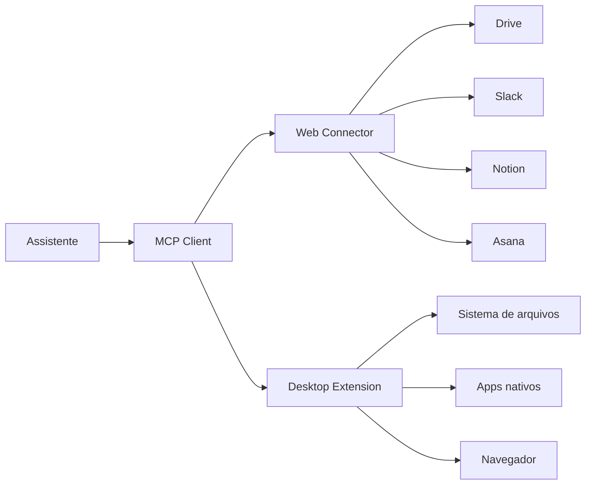

> [!abstract]
> Um **Connector** é a ligação entre um assistente de IA e uma ferramenta externa — arquivos, e-mail, chat, CRM, gestão de projetos — que permite ao assistente **ler** dados e, conforme a permissão, **executar ações** dentro daquela aplicação.

## Conceito

Sem conector, todo contexto entra pelo prompt: você copia, cola, anexa. O conector inverte isso — o assistente vai até a fonte.

O efeito não é "respostas melhores". É que o **espaço de perguntas possíveis** cresce. O mesmo pedido — *"redija uma atualização de status do projeto de orçamento para meu gestor"* — é atendível só com o que você digitou; ligue o armazenamento em nuvem e ele pode consultar a planilha; ligue o e-mail e ele pega a última troca com o fornecedor; ligue o chat do time e ele captura a decisão de ontem. O pedido não mudou. Mudou o que ele pode considerar.

O conector também **age**: cria tarefas, atualiza registros, envia rascunhos — sempre dentro do escopo de permissão concedido.

## Fundação técnica

Conectores são construídos sobre o [[Model Context Protocol (MCP)]]. A analogia usada pela Anthropic é direta: **MCP é o USB-C da IA** — um padrão único que substitui uma integração ad hoc por conexão. Sendo padrão aberto, o conector escrito por um desenvolvedor funciona em qualquer cliente compatível.

## Tipos

| | Web Connector | Desktop Extension |
|---|---|---|
| Alvo | Serviços de nuvem (Drive, Notion, Slack, Asana, Stripe) | Recursos locais da máquina |
| Onde roda | Servidor do serviço | App desktop, na sua máquina |
| Autenticação | OAuth no site do serviço | Instalação local |
| Exemplos de uso | Buscar thread, criar tarefa, ler doc | Ler pasta local, controlar navegador, integrar app nativo |

## Modelo de segurança

- **Acesso escopado** — a permissão é específica ao que o conector precisa, e granular por capacidade
- **O assistente vê o que você vê** — conectar seu e-mail corporativo não dá acesso à caixa de outra pessoa; a autorização é herdada da sua
- **Revogável** — pela configuração do assistente ou pelo painel de segurança do próprio serviço

> [!warning] Conector customizado é código de terceiro
> Vale a mesma regra de [[Agent Skill|Skills]]: só instale de fonte confiável, e revise antes de usar. Um conector com permissão de escrita age em seu nome.

## Comparação

| | Connector | Upload de arquivo | [[Enterprise Search]] |
|---|---|---|---|
| Atualidade | Sempre a versão viva | Congelado no momento do upload | Sempre a versão viva |
| Escopo | A ferramenta conectada | O arquivo enviado | Todas as fontes da organização |
| Escreve | Sim, conforme permissão | Não | Não — é de leitura |

## Veja também

- [[Model Context Protocol (MCP)]]
- [[Enterprise Search]]
- [[Agent Skill]]
- [[Computer Use]]
- [[Agentic Workflow]]
