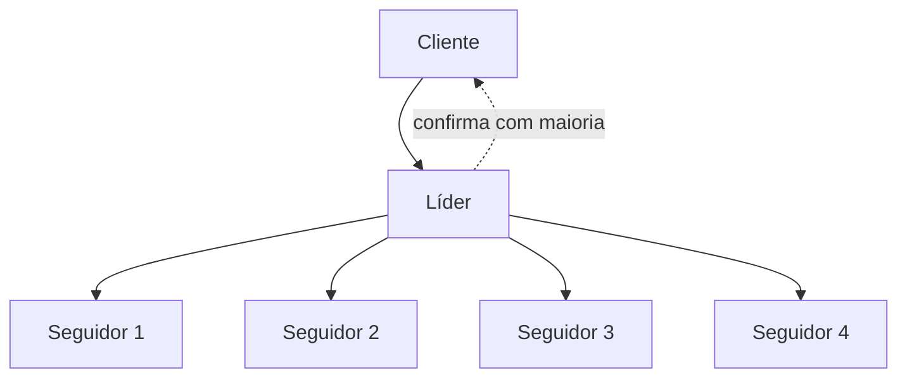

> [!abstract]
> Consensus é o problema de fazer múltiplos servidores concordarem sobre um valor, de forma que a decisão seja **final** — a base de qualquer sistema distribuído tolerante a falhas.

## Conceito

Consenso costuma aparecer no contexto de **máquinas de estado replicadas**: cada servidor tem um log de comandos e uma máquina de estado. Se todos aplicam os mesmos comandos na mesma ordem, todos chegam ao mesmo estado — e o cliente enxerga um único servidor confiável, mesmo que a minoria falhe.

O algoritmo de consenso é o que garante essa ordem: se alguma máquina aplicou `set x = 3` como enésimo comando, **nenhuma outra jamais aplicará um enésimo comando diferente**.

## A regra da maioria

Algoritmos de consenso progridem enquanto **qualquer maioria** dos servidores estiver disponível. Um cluster de 5 continua operando com 2 falhas; com 3, ele para — mas **nunca retorna resultado incorreto**. Parar é o comportamento desejado, não o defeito.

> [!important] Por isso os clusters têm número ímpar
> Com 5 nós tolera-se 2 falhas; com 6, também 2. O sexto nó adiciona custo e nenhuma tolerância.

## Algoritmos

| Algoritmo | Nota                                                                                                                                                                                     |
| --------- | ---------------------------------------------------------------------------------------------------------------------------------------------------------------------------------------- |
| **Paxos** | O clássico (Lamport). Correto e notoriamente difícil de entender e implementar                                                                                                           |
| **Raft**  | Equivalente a Paxos em tolerância a falhas e desempenho; projetado para ser **compreensível**, decomposto em subproblemas independentes: eleição de líder, replicação de log e segurança |
| **ZAB**   | Usado pelo ZooKeeper                                                                                                                                                                     |

Raft nasceu de uma constatação incômoda: se o algoritmo é difícil demais de entender, as implementações reais serão de qualidade duvidosa. A compreensibilidade era o objetivo de projeto declarado.

## Onde aparece na prática

- **etcd** — o armazenamento de estado do [[Kubernetes (K8s)]] usa Raft
- **ZooKeeper e Consul** — coordenação e eleição de líder
- Eleição de líder em bancos replicados e em [[Database Sharding]]

> [!warning]
> Consenso custa caro: cada decisão exige ida e volta à maioria dos nós. É por isso que sistemas de larga escala o usam para **metadados e coordenação**, não para o caminho de dados — que fica com [[Eventual Consistency]].

## Fonte

- Diego Ongaro e John Ousterhout, [In Search of an Understandable Consensus Algorithm](https://raft.github.io/raft.pdf), USENIX ATC 2014 — Best Paper Award
- Martin Kleppmann, *Designing Data-Intensive Applications*, cap. 9, O'Reilly, 2017

## Veja também

- [[CAP Theorem]]
- [[Eventual Consistency]]
- [[Distributed Systems]]
- [[Two-Phase Commit]]
- [[Kubernetes (K8s)]]
- [[System Design MOC]]
