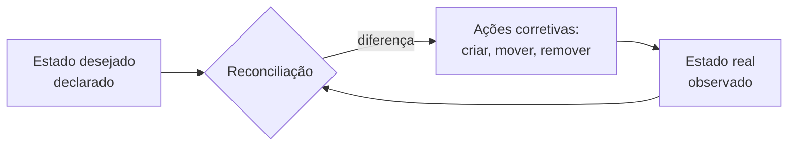

> [!abstract]
> Container Orchestration é a automação da implantação, escala, rede e recuperação de contêineres através de um conjunto de máquinas tratado como um recurso único.

## Conceito

Um contêiner em um host é simples. Centenas de contêineres em dezenas de hosts trazem perguntas que nenhuma ferramenta de contêiner isolada responde: em qual máquina este contêiner deve rodar, o que acontece quando ela cai, como o tráfego chega até ele, como subir mais réplicas sob carga.

O orquestrador responde a todas com o mesmo mecanismo: **reconciliação de estado desejado**. O operador declara o que quer; o orquestrador compara com o que existe e age continuamente para eliminar a diferença.

## Responsabilidades

- **Scheduling** — decidir em qual nó cada carga roda, respeitando recursos e restrições
- **Self-healing** — recriar o que morreu, remover o que não responde
- **Escala** — ajustar o número de réplicas conforme demanda
- **Rede e descoberta** — dar endereço estável a cargas efêmeras
- **Rollout e rollback** — atualizar sem derrubar o serviço

## Comparação

| | **Docker** | **Kubernetes** |
|---|---|---|
| Nível | Host individual | Cluster de nós |
| Foco | Empacotar e executar | Gerenciar e orquestrar em escala |
| Rede, política, storage | Configuração manual por host | Automatizados no cluster |
| Modelo | Imperativo | Declarativo |

## Veja também

- [[Container]]
- [[Kubernetes (K8s)]]
- [[Cloud Native]]
- [[Infrastructure as Code]]
- [[Immutable Infrastructure]]
