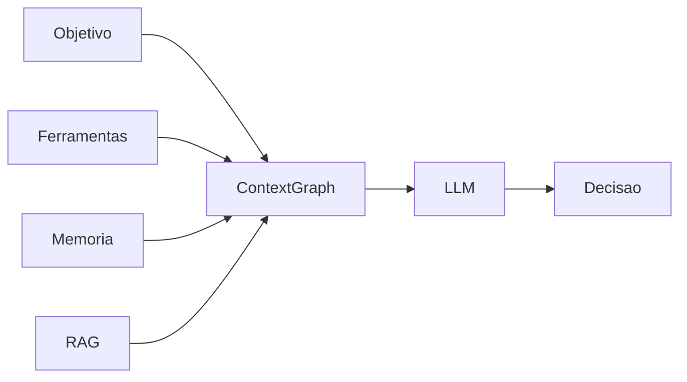

> [!abstract]
> Um **Context Graph** representa o estado atual de uma tarefa ou execução, reunindo informações temporárias, memória, contexto e resultados intermediários necessários para que agentes e LLMs possam tomar decisões.

## Conceito

Enquanto um [[Knowledge Graph]] descreve o conhecimento permanente sobre um domínio, o Context Graph representa apenas aquilo que é relevante para uma determinada execução.

Seu conteúdo muda continuamente conforme a conversa evolui, novas ferramentas são executadas e novas informações são descobertas.

Por esse motivo, o Context Graph é considerado uma **memória operacional** da arquitetura.

---

## Componentes

Um Context Graph normalmente reúne:

- Objetivo da tarefa
- Estado atual da execução
- Memória de curto prazo
- Resultados intermediários
- Evidências recuperadas
- Informações obtidas por ferramentas
- Relações entre todos esses elementos

---

## Características

- Dinâmico
- Temporário
- Específico da execução
- Evolui continuamente
- Compartilhado entre agentes durante a execução

---

## Fluxo Conceitual

---

## Relação com outras tecnologias

O Context Graph normalmente é alimentado por:

- [[Retrieval-Augmented Generation (RAG)]]
- [[Knowledge Graph]]
- [[Model Context Protocol (MCP)]]
- Memória dos agentes
- Resultados produzidos por outros agentes

---

## Knowledge Graph x Context Graph

| Knowledge Graph | Context Graph |
|-----------------|---------------|
| Conhecimento permanente | Estado atual |
| Compartilhado | Específico da execução |
| Pouco mutável | Altamente dinâmico |
| Modela o domínio | Modela a tarefa |
| Longa duração | Curta duração |

> [!important]
> O Context Graph não substitui o Knowledge Graph. Ambos possuem responsabilidades diferentes e complementares.

---

## Papel em Arquiteturas Multiagentes

Em arquiteturas compostas por múltiplos agentes, o Context Graph atua como a representação compartilhada do estado atual da execução.

Ele permite que diferentes agentes trabalhem sobre o mesmo contexto sem depender exclusivamente do histórico textual da conversa.

---

## Veja também

- [[Knowledge Graph]]
- [[Large Language Model (LLM)]]
- [[Retrieval-Augmented Generation (RAG)]]
- [[Model Context Protocol (MCP)]]
- [[Agent Runtime]]
- [[Agent Memory]]
- [[Context Window]]
