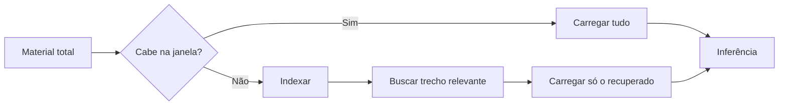

> [!abstract]
> A **Context Window** é a quantidade máxima de tokens que um modelo de linguagem consegue considerar de uma só vez — prompt, histórico da conversa, arquivos anexados e a própria resposta em geração, todos somados.

## Conceito

A janela de contexto é o **orçamento de atenção** de uma interação. Tudo que o modelo "sabe" naquele turno específico — instruções de sistema, mensagens anteriores, documentos carregados, resultados de ferramentas — compete pelo mesmo espaço finito.

É a restrição de projeto mais consequente ao se desenhar qualquer aplicação sobre um [[Large Language Model (LLM)]]. Ela determina quanto material cabe numa análise, quão longa uma conversa pode ficar antes de degradar, e se você precisa ou não de uma estratégia de recuperação.

Ordens de grandeza atuais: 200K tokens equivalem a mais ou menos 500 páginas de texto; janelas de 1M token existem em planos e modelos específicos.

## O que acontece quando estoura

Três estratégias, em ordem crescente de sofisticação:

1. **Truncar** — descartar o início do histórico. Barato e lesivo: o modelo esquece o começo da conversa.
2. **Sumarizar** — comprimir o histórico antigo num resumo. Preserva o fio, perde o detalhe.
3. **Recuperar** — não carregar tudo; buscar sob demanda só o trecho relevante. É [[Retrieval-Augmented Generation (RAG)]], e é o que um [[Project Workspace]] faz automaticamente quando sua base cresce.

## Características

- **Finita e compartilhada** — instruções, histórico, anexos e resposta disputam o mesmo espaço
- **Volátil** — some ao fim da sessão, salvo mecanismo explícito de [[Agent Memory|memória]]
- **Não é conhecimento** — é o que está *à mão* agora, não o que o modelo aprendeu no treinamento
- **Degrada antes de estourar** — a atenção sobre um contexto muito longo é desigual; encher a janela nem sempre melhora a resposta

> [!warning] Janela grande não substitui curadoria
> Jogar mil páginas irrelevantes numa janela de 1M token piora o resultado. O ganho de janela grande é poder **considerar** muito material, não poder **dispensar** a seleção do material certo.

## Comparação

| | Context Window | Memória (persistente) | Conhecimento do modelo |
|---|---|---|---|
| Duração | A sessão | Entre sessões | Fixo até o retreino |
| Origem | Você fornece | Extraído das conversas | Dados de treinamento |
| Custo | Tokens por chamada | Armazenamento + injeção seletiva | Zero em uso |
| Editável | Sim, refazendo o prompt | Sim, nas configurações | Não |

## Veja também

- [[Large Language Model (LLM)]]
- [[Retrieval-Augmented Generation (RAG)]]
- [[Agent Memory]]
- [[Context Graph]]
- [[Project Workspace]]
