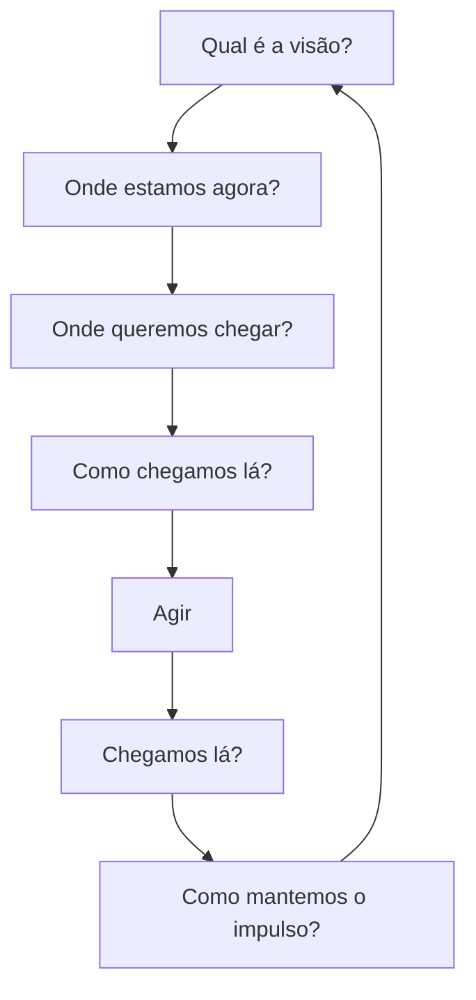

> [!abstract]
> O Continual Improvement Model é o roteiro de sete perguntas que estrutura qualquer iniciativa de melhoria, da visão à verificação do resultado.

## Estrutura

## Dinâmica

1. **Qual é a visão?** — vincular a melhoria a [[Vision]] e [[Strategy]]
2. **Onde estamos agora?** — baseline honesto, medido ([[Start Where You Are]])
3. **Onde queremos chegar?** — alvo mensurável, não adjetivo
4. **Como chegamos lá?** — plano em incrementos verificáveis
5. **Agir** — executar
6. **Chegamos lá?** — verificar contra o baseline, não contra a percepção
7. **Como mantemos o impulso?** — sustentar ou o ganho regride

> [!warning]
> Pular o passo 2 é o erro mais comum. Sem baseline, o passo 6 vira debate de opinião.

## Veja também

- [[Continual Improvement]]
- [[Metrics]]
- [[Critical Success Factor (CSF)]]
- [[Start Where You Are]]
