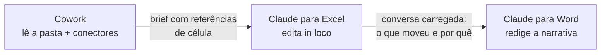

> [!abstract]
> **Continuidade de contexto entre superfícies** é a propriedade de uma conversa sobreviver à troca de ferramenta: a análise feita no [[Claude Cowork]] chega ao add-in da planilha e de lá ao editor de texto, sem que o trabalho precise ser reexplicado a cada passagem.

## Conceito

Trabalho analítico real atravessa ferramentas. Ler os documentos e comparar contra a política é uma coisa; editar a célula com a fórmula quebrada é outra; redigir o memorando que explica a decisão é uma terceira. Cada uma tem a superfície certa — e, historicamente, cada troca de superfície custava recontar o caso do zero.

A continuidade elimina esse pedágio. O que muda entre as superfícies é o **tipo de operação**, não o assunto:

| Superfície | Operação | Por que ali |
|---|---|---|
| [[Claude Cowork]] | Ler, cruzar, diagnosticar | É onde a pasta inteira e os [[Connector\|conectores]] estão disponíveis |
| Add-in de planilha | Editar célula, rodar cenário | É onde o modelo vive e a fórmula é verificável |
| Add-in de editor | Redigir a narrativa | É onde o documento final é entregue |

## O brief é o artefato de passagem

A continuidade não é mágica: ela se sustenta num artefato explícito. Encerrar a sessão do Cowork pedindo **um brief curto com as referências de célula e as exceções** é o que torna a passagem verificável — mais preciso que rolar a conversa para trás, e revisável antes de qualquer edição.

O padrão recorrente do brief é: *onde o número está contra a política*, *qual célula produz isso*, *qual é o driver*, *o que é erro e o que é movimento a explicar*.

## Características

- **Direcional** — vai do diagnóstico à edição e da edição à narrativa; a volta é uma nova pergunta, não um retorno automático
- **Ancorada em referência** — `Triangles!K47`, `Assumptions!B22`: o achado aponta para o lugar exato, clicável
- **Preserva a decisão, não só o dado** — o editor sabe *quais exceções você escolheu levar ao comitê*, não apenas os números
- **Separa diagnóstico de mutação** — quem lê e acusa não é quem altera; a alteração acontece com o arquivo aberto na frente de quem assina

> [!important] Quem decide continua sendo você
> O padrão explícito das fontes é *"o Claude puxa os spreads e roda os índices; você toma a decisão de crédito"*. A continuidade acelera o trajeto entre as superfícies — não transfere a assinatura. Ver [[Human-in-the-Loop]].

## Veja também

- [[Claude Cowork]]
- [[Work in a Folder]]
- [[Agentic Workflow]]
- [[Context Window]]
- [[Human-in-the-Loop]]
- [[Da Conversa à Skill e ao Agendamento]]
