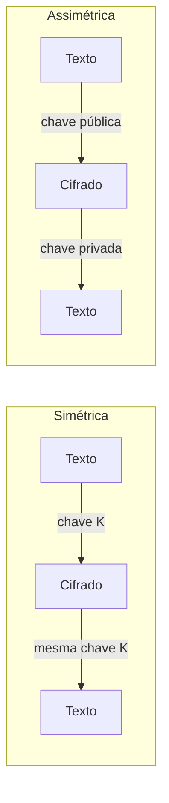

> [!abstract]
> As duas famílias de cifragem diferem em quantas chaves usam — e essa diferença determina o que cada uma consegue fazer bem: uma é rápida, a outra resolve o problema de distribuir a chave.

## Conceito

Cifrar exige que emissor e receptor concordem sobre uma chave. O problema é que **combinar a chave já exige um canal seguro** — e se ele existisse, não haveria necessidade de cifrar. A criptografia assimétrica resolve esse impasse; a simétrica resolve o volume.

## Comparação

| | **Simétrica** | **Assimétrica** |
|---|---|---|
| Chaves | Uma, usada para cifrar e decifrar | Par: pública cifra, privada decifra |
| Velocidade | Rápida — adequada a grandes volumes | Lenta — geração de chaves e matemática pesada |
| Distribuição da chave | Problema central: emissor e receptor compartilham o segredo | Resolvido: a chave pública circula livremente |
| Segurança relativa | Depende de proteger a chave compartilhada | Maior — a chave privada nunca é transmitida |
| Uso típico | Cifrar volumes de dados, PII em repouso | Estabelecer chave de sessão, assinatura digital |

## O padrão híbrido

Sistemas reais usam as duas em sequência, cada uma no que faz melhor:

1. **Assimétrica** para negociar com segurança uma chave de sessão
2. **Simétrica** com essa chave para todo o tráfego seguinte

É exatamente o que faz [[Transport Layer Security (TLS)]] — assimétrica no handshake, simétrica depois. O mesmo padrão aparece em cifragem de e-mail e em armazenamento cifrado.

> [!important] Cifrar não é hashear
> Cifragem é **reversível** por desenho: o objetivo é recuperar o texto original. Hash é **unidirecional**: não existe operação inversa. Por isso senha se armazena com hash e nunca com cifragem. Ver [[Armazenamento Seguro de Senhas]].

## Fonte

- ByteByteGo, *Symmetric encryption vs asymmetric encryption* — BIG ARCHIVE: System Design 2023
- OWASP, [Cryptographic Storage Cheat Sheet](https://cheatsheetseries.owasp.org/cheatsheets/Cryptographic_Storage_Cheat_Sheet.html)

## Veja também

- [[Transport Layer Security (TLS)]]
- [[Armazenamento Seguro de Senhas]]
- [[JSON Web Token (JWT)]]
- [[Segurança de API]]
- [[System Design MOC]]
