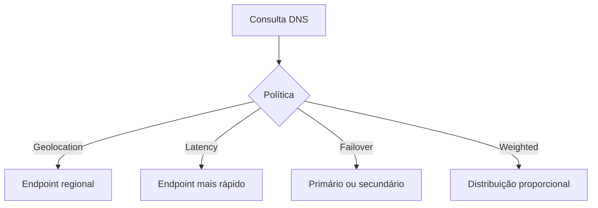

> [!abstract]
> DNS Routing Policy é a regra que determina qual endereço será devolvido em uma consulta DNS, transformando a resolução de nomes em um mecanismo de distribuição de tráfego global.

## Conceito

O DNS costuma ser tratado como uma tabela estática de nome para IP, mas a resposta pode depender de quem perguntou, de onde perguntou e do estado dos destinos. É o ponto de controle mais barato para distribuir tráfego entre regiões — e o mais grosseiro, porque o cliente e os resolvedores intermediários fazem cache da resposta.

## Políticas

| Política | Critério da resposta |
|---|---|
| **Simple** | Sempre o mesmo endpoint, sem condição |
| **Failover** | Endpoint primário; muda para o secundário se o primário estiver indisponível |
| **Geolocation** | Localização geográfica de quem consultou |
| **Latency** | Endpoint com a menor latência medida para aquele solicitante |
| **Multivalue answer** | Devolve vários IPs e deixa o cliente escolher |
| **Weighted** | Distribuição proporcional aos pesos configurados |

> [!warning]
> Multivalue answer **não substitui** um [[Load Balancer]]: não há health check por conexão, não há algoritmo de distribuição e o TTL faz o cliente insistir em um endereço morto até a expiração.

## Veja também

- [[Load Balancer]]
- [[Content Delivery Network (CDN)]]
- [[High Availability]]
- [[Disaster Recovery]]
- [[Latency Numbers]]
