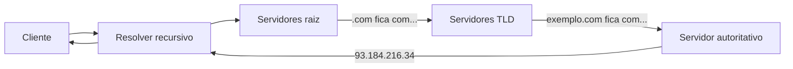

> [!abstract]
> DNS é o sistema hierárquico e distribuído que traduz nomes legíveis por humanos em endereços IP — a maior base de dados distribuída em operação contínua no mundo.

## Conceito

Ninguém decora endereços IP, e eles mudam. O DNS resolve isso com uma **hierarquia delegada**: nenhum servidor conhece tudo, cada nível sabe apenas para quem perguntar em seguida.

## Tipos de registro

| Registro | Para quê |
|---|---|
| **A / AAAA** | Nome → endereço IPv4 / IPv6 |
| **CNAME** | Nome → outro nome (apelido) |
| **MX** | Servidor de e-mail do domínio |
| **TXT** | Texto livre — verificação de domínio, SPF, DKIM |
| **NS** | Quem é autoritativo pelo domínio |

## Consistência eventual na prática

> [!important] O DNS é o exemplo mais difundido de [[Eventual Consistency]]
> A atualização de um nome se propaga segundo o padrão configurado, em combinação com caches controlados por tempo. Eventualmente todos os clientes veem a mudança — mas não há garantia de quando. É essa janela de inconsistência, o **TTL**, que faz a troca de IP levar horas para valer em toda a internet.

Também é por isso que [[DNS Routing Policy]] é um mecanismo grosseiro de distribuição de tráfego: o cliente e os resolvedores intermediários guardam a resposta e continuam insistindo em um endereço morto até a expiração.

## Características

- Usa [[UDP]] na porta 53 para consultas comuns; recorre a [[TCP]] quando a resposta é grande
- **DNSSEC** acrescenta assinatura para provar que a resposta não foi forjada
- **DoH e DoT** cifram a consulta, que historicamente trafega em texto claro

## Fonte

- Paul Mockapetris, [RFC 1034 — Domain Names: Concepts and Facilities](https://datatracker.ietf.org/doc/html/rfc1034) e [RFC 1035](https://datatracker.ietf.org/doc/html/rfc1035), IETF, 1987

## Veja também

- [[DNS Routing Policy]]
- [[Eventual Consistency]]
- [[UDP]]
- [[Modelo OSI]]
- [[Load Balancer]]
- [[URI, URL e URN]]
- [[System Design MOC]]
