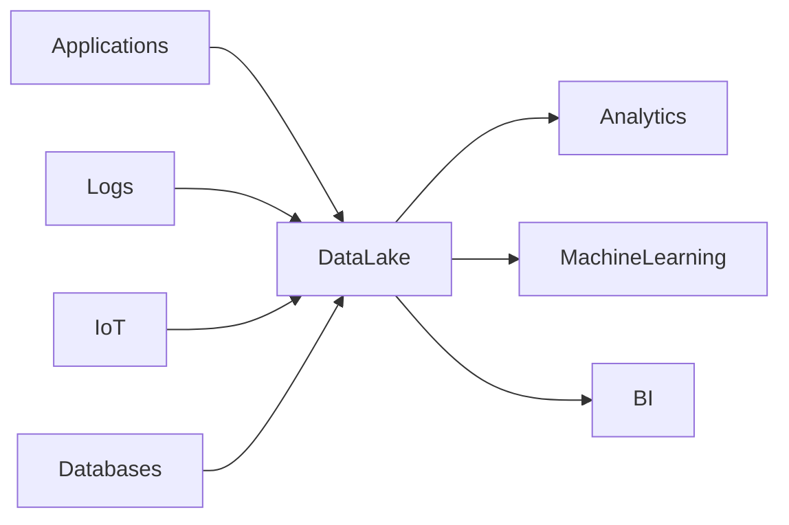

Data Lake é um repositório centralizado capaz de armazenar grandes volumes de dados estruturados, semiestruturados e não estruturados em seu formato original.

Os dados são preservados para processamento e análise futura.

> [!info]
> Diferentemente de um Data Warehouse, um Data Lake armazena os dados antes da modelagem.

## Características

- Armazenamento massivo
- Baixo custo
- Dados brutos
- Escalabilidade praticamente ilimitada

## Casos de uso

- Business Intelligence
- Machine Learning
- Big Data
- Analytics
- Data Science

## Tecnologias

- Amazon S3
- Azure Data Lake Storage
- Google Cloud Storage

## Vantagens

- Flexibilidade
- Baixo custo
- Grande capacidade

## Desafios

- Governança
- Catálogo de dados
- Qualidade dos dados

## Veja também

- [[Data Pipeline]]
- [[Object Storage]]
- [[Data Warehouse]]
- [[Storage]]