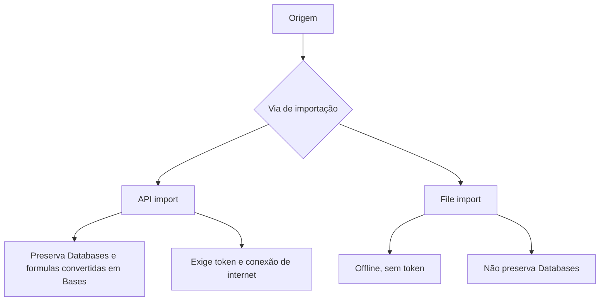

> [!abstract]
> **Data portability** é a propriedade de um acervo de notas poder sair do aplicativo que o hospeda sem perder o que importa — e, no Obsidian, ela é consequência direta de guardar tudo como Markdown em texto plano no seu disco.

## Conceito

A tese está na primeira linha da página de importação:

> [!quote]
> "Apps come and go, but your data should last."

A portabilidade não é um recurso do importador; é uma propriedade do formato de destino. O Obsidian usa arquivos Markdown não proprietários armazenados localmente, e disso decorre tanto o funcionamento offline quanto a possibilidade de trocar de app depois. É o mesmo raciocínio que sustenta [[Local-first]] e a defesa contra [[Vendor Lock-in]].

O que a documentação de importação ensina, quando lida de ponta a ponta, é uma taxonomia de perdas. Migrar não é uma operação binária — é uma negociação sobre quais camadas de estrutura sobrevivem.

## Duas famílias de importação

- **API import** — preserva o workspace inteiro, incluindo Databases e formulas, convertidos em [[Base (Obsidian Bases)|Bases]]. Exige um token de integração e internet. Rate limits do provedor tornam workspaces grandes demorados
- **File import** — parte de um arquivo exportado, funciona offline e sem token, mas **não preserva Databases**

## Duas ferramentas distintas

| | Importer | Format converter |
|---|---|---|
| Tipo | **Community plugin oficial**, feito pela equipe do Obsidian, open source | **Core plugin** |
| O que faz | Traz dados de outro app para dentro do vault | Converte a sintaxe do vault que já existe |
| Escopo | O que você seleciona na importação | **O vault inteiro**, segundo as settings |
| Pré-requisito | Instalar e habilitar pelo Community plugins | **Fazer backup antes** — a doc avisa explicitamente |
| Cobertura | Notion, Airtable, OneNote, Evernote, Apple Notes, Apple Journal, Google Keep, Bear, Craft, Roam, HTML, CSV, Markdown, Textbundle | Roam, Bear, Zettelkasten e [[Properties (Frontmatter)\|properties]] depreciadas |

O Format converter cobre: Roam — `#tag` e `#[[tag]]` viram `[[tag]]`, `^^highlight^^` vira `==highlight==`, `{{[[TODO]]}}` vira `[ ]`; Bear — `::highlight::` vira `==highlight==`; Zettelkasten — `[[UID]]` vira `[[UID File Name]]`, ou `[[UID File Name|File Name]]` com o beautifier. Desde o Obsidian `1.9.3`, converte também `alias:` para `aliases:`, `tag:` para `tags:` e `cssclass:` para `cssclasses:`.

## Taxonomia das perdas

- **Por limitação da API de origem** — no Notion, linked data sources não são importados e as funções `name()`, `email()`, `style()` e `unstyle()` não têm conversão. No Airtable, rollup values não são importados porque a API não expõe a agregação usada
- **Por ausência de equivalente no Obsidian** — funções do Airtable como `SWITCH`, `FIND`, `REGEX_EXTRACT` e `SQRT` caem para o valor estático calculado na origem. Reminders e user assignments do Google Keep não são importados porque o Obsidian não tem esses recursos
- **Por ausência de dado no export** — o Google Keep não exporta informação de indentação, então todos os checklists chegam como itens de primeiro nível. O export do Evernote não preserva a hierarquia de tags, que precisa ser "achatada" manualmente em `ParentTag/ChildTag`, nem a informação de notebook stacks, recuperável renomeando o arquivo para `Stack1@@@NotebookA`
- **Por criptografia ou lock** — notas do Apple Notes protegidas por senha são cifradas pela Apple e **puladas** se não forem destravadas antes
- **Por incompatibilidade de modelo** — no Notion se pode escrever conteúdo dentro de uma pasta; no Obsidian não, e essas páginas viram subpáginas da pasta. No Airtable, views de calendar, kanban, timeline e Gantt são ignoradas, e links para registros de tabelas não selecionadas viram texto simples

## O Textbundle como formato-ponte

O Textbundle empacota o texto Markdown **e todas as imagens referenciadas** num único arquivo. A doc é precisa sobre o propósito: "providing a more seamless way to move out of a sandboxed application". Ele é exportado por Agenda, Craft, Taio, Ulysses, Zettlr e outros. É a resposta ao problema mais comum de qualquer migração via Markdown puro — o texto sai, os anexos ficam.

## Tabela de migrações

| Origem | Ferramenta | Formato de export | Preserva | Perde |
|---|---|---|---|---|
| Notion | Importer, API | API com token `ntn_...` | Workspace inteiro, Databases e formulas como Bases | Linked data sources, `name()`, `email()`, `style()`, `unstyle()`, views secundárias de cada database |
| Notion | Importer, arquivo | `.zip` em **HTML**, não Markdown | Conteúdo e links internos | **Databases** |
| Airtable | Importer, API | API com token `pat...` | Uma nota por registro, `.base` por tabela, grid/gallery/list como views, anexos baixados | Rollups, funções sem equivalente, views de calendar/kanban/timeline/Gantt, interfaces, automations, comments, revision history |
| Evernote | Importer | `.enex` por notebook | Conteúdo das notas | Hierarquia de tags e notebook stacks — recuperáveis à mão |
| Google Keep | Importer | `.zip` do Google Takeout | Conteúdo e tags | Indentação dos checklists, reminders, user assignments |
| Apple Notes | Importer, só macOS | Leitura direta de `group.com.apple.notes` | Tabelas, imagens, drawings, scans, PDFs, links | Notas protegidas por senha, se não destravadas |
| Textbundle | Importer | `.textbundle`, `.textpack`, `.zip` | Markdown **e as imagens referenciadas** | O que o app de origem já não tinha posto no bundle |

## A leitura central

**Formatos fechados perdem estrutura; formatos abertos perdem no máximo sintaxe.** As perdas do Notion e do Airtable são de *modelo* — uma view de kanban, um rollup, uma função de fórmula: coisas que não existem do outro lado e não voltam. Já as perdas do Roam, do Bear e de um acervo Zettelkasten são de *dialeto* — `^^destaque^^` em vez de `==destaque==`, `[[UID]]` em vez de `[[UID Título]]`. E dialeto é exatamente o que o Format converter conserta, em lote, no vault inteiro.

É por isso que a [[Unique Note (Zettelkasten Prefix)|convenção de nomes]] importa como estratégia de saída: quanto mais a estrutura mora no texto e no nome do arquivo, menos há a perder na próxima migração.

## Veja também

- [[Vendor Lock-in]]
- [[Local-first]]
- [[Unique Note (Zettelkasten Prefix)]]
- [[Base (Obsidian Bases)]]
- [[Migrar uma Base de Conhecimento para o Obsidian]]
