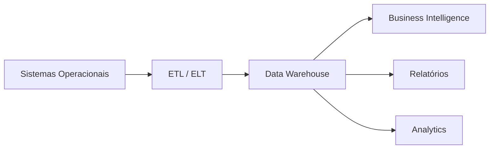

Data Warehouse é um repositório de dados estruturados, organizado para consultas analíticas, Business Intelligence (BI) e geração de relatórios.

Os dados são extraídos de diferentes sistemas, transformados e armazenados em um modelo otimizado para análise.

> [!info]
> Diferentemente de um [[Data Lake]], um Data Warehouse armazena dados já tratados, organizados e modelados para consultas rápidas.

## Características

- Dados estruturados
- Modelo dimensional
- Alto desempenho para consultas
- Histórico consolidado

## Casos de uso

- Dashboards
- Business Intelligence
- Indicadores corporativos
- Análises históricas

## Exemplos

- Amazon Redshift
- Google BigQuery
- Snowflake
- Azure Synapse Analytics

## Data Lake x Data Warehouse

| Característica | Data Lake | Data Warehouse |
|----------------|-----------|----------------|
| Dados | Brutos | Processados |
| Estrutura | Flexível | Modelada |
| Uso | Data Science | BI |
| Custo | Menor | Maior |
| Performance analítica | Média | Alta |

## Veja também

- [[Data Pipeline]]
- [[Data Lake]]
- [[ETL]]
- [[ELT]]
- [[Business Intelligence]]