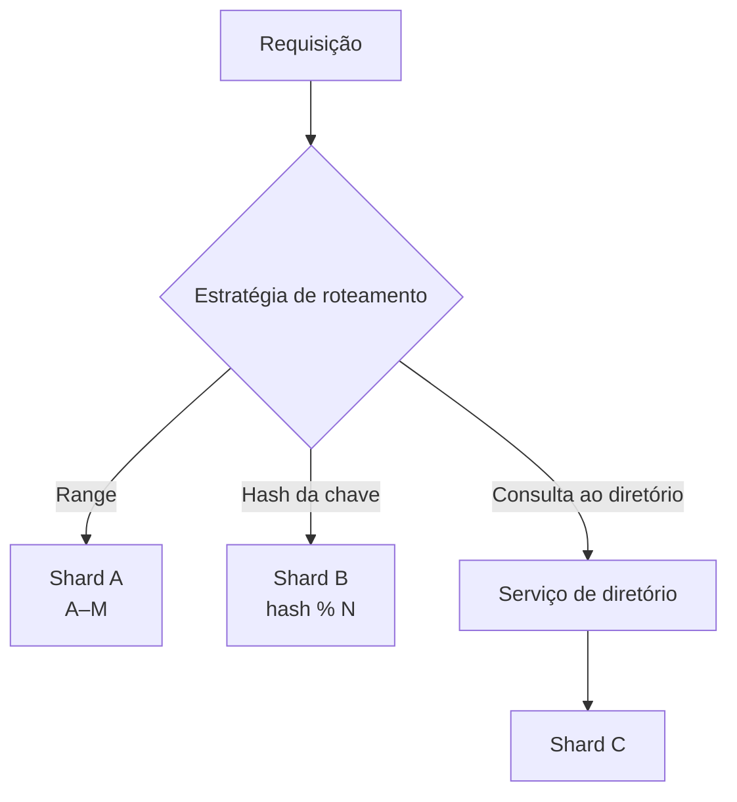

> [!abstract]
> Database Sharding é a divisão de uma base de dados em partições independentes (*shards*), cada uma guardando um subconjunto disjunto das linhas, de modo que nenhuma máquina precise conter a base inteira.

## Conceito

Particionamento tem duas direções. O **vertical** separa colunas ou tabelas por afinidade — é o que naturalmente acontece quando cada microsserviço ganha seu banco. O **horizontal**, que é o sharding propriamente dito, separa *linhas*: cada shard tem o mesmo esquema e dados diferentes.

O problema central do sharding não é armazenar, é **rotear**. Toda leitura e toda escrita precisam descobrir em qual shard o dado vive antes de qualquer outra coisa, e é a estratégia de roteamento escolhida que define o custo de crescer o cluster depois.

## Estratégias

| Estratégia | Como roteia | Ponto forte | Ponto fraco |
|---|---|---|---|
| **Range-based** | Faixas de valor da chave | Consultas por intervalo ficam locais | *Hotspots* quando a distribuição é desigual |
| **Key/Hash-based** | Função hash sobre a chave (`hash % N`) | Distribuição uniforme | Mudar `N` rebalanceia quase tudo |
| **Directory-based** | Tabela de lookup consultada a cada acesso | Rebalanceamento flexível | O diretório vira ponto único de falha e de latência |

## Características

- Cada shard é operado como um banco autônomo: replicação, backup e failover são por shard
- Consultas que cruzam shards perdem `JOIN` e transação nativa — a agregação sobe para a aplicação
- Escolher a *shard key* é a decisão mais cara de reverter em todo o desenho
- Sharding é resposta a limite de **volume e throughput**, não a limite de disponibilidade — para isso existe replicação

> [!warning]
> Sharding com hash simples (`hash % N`) transforma qualquer adição de nó em uma migração massiva de dados. É o motivo pelo qual sistemas maduros usam *consistent hashing* ou um diretório.

## Veja também

- [[Database Index]]
- [[CAP Theorem]]
- [[Distributed ID Generator]]
- [[Distributed Cache]]
- [[Microservices]]
