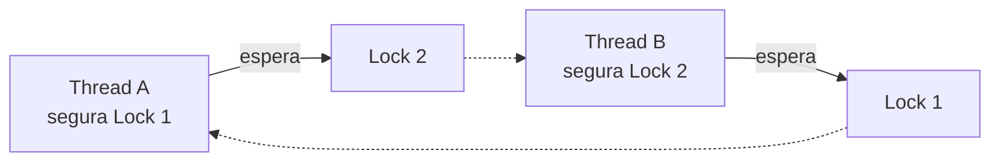

> [!abstract]
> Deadlock é o estado em que dois ou mais fluxos ficam **esperando uns pelos outros para sempre** — cada um segurando o recurso de que o outro precisa.

## Conceito

Nenhum dos dois vai ceder, porque nenhum dos dois pode prosseguir. O sistema não trava com erro — ele simplesmente **para de progredir**, o que é bem mais difícil de diagnosticar.

## As quatro condições de Coffman

O deadlock só ocorre quando **todas as quatro** valem ao mesmo tempo. Quebrar qualquer uma o elimina:

| Condição | Como quebrar |
|---|---|
| **Exclusão mútua** — o recurso não é compartilhável | Usar recursos compartilháveis quando possível |
| **Posse e espera** — segura um e pede outro | Adquirir todos os recursos de uma vez, ou nenhum |
| **Não preempção** — o recurso não pode ser tomado à força | Permitir que o sistema retome o recurso |
| **Espera circular** — existe um ciclo na cadeia de espera | **Ordenar globalmente** a aquisição de locks |

> [!tip] A quebra mais praticável é a quarta
> Estabelecer uma ordem global de aquisição — sempre pegar o Lock 1 antes do Lock 2 — elimina o ciclo por construção e não custa desempenho. As outras três exigem abrir mão de garantias ou de simplicidade.

## Onde aparece fora da concorrência local

- **Banco de dados**: duas transações atualizando as mesmas linhas em ordem inversa. O engine detecta o ciclo e **aborta uma delas** — daí a exigência de tratar erro de deadlock e retentar
- **Distribuído**: [[Two-Phase Commit]] com o coordenador fora do ar deixa os participantes bloqueados segurando locks, o que é a mesma patologia sem o ciclo
- **Pool de recursos**: um [[Thread Pool]] em que as tarefas esperam por outras tarefas do mesmo pool trava por esgotamento — *thread starvation deadlock*

> [!warning]
> Adicionar timeout a cada espera não resolve o deadlock, apenas o converte em falha detectável. É uma mitigação legítima — e frequentemente a única viável — mas o ciclo continua ali, e voltará sob carga.

## Fonte

- E. G. Coffman, M. Elphick e A. Shoshani, *System Deadlocks*, ACM Computing Surveys, 1971
- Andrew S. Tanenbaum, *Modern Operating Systems*, Pearson

## Veja também

- [[Race Condition]]
- [[Thread]]
- [[Thread Pool]]
- [[Two-Phase Commit]]
- [[Timeout]]
- [[System Design MOC]]
