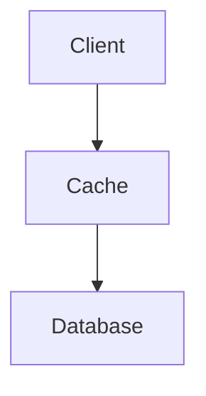

Distributed Cache é um cache compartilhado entre vários servidores.

Seu objetivo é reduzir a carga sobre bancos de dados e diminuir a latência.

> [!tip]
> O cache deve armazenar apenas dados que possam ser reconstruídos.

A leitura em memória custa cerca de **100 ns** contra **100 µs** de um SSD — três ordens de grandeza (ver [[Latency Numbers]]). É essa diferença, e não um ajuste marginal, que muda o comportamento do sistema.

Introduzir cache cria um segundo lugar onde a verdade mora: manter os dois em sincronia exige escolher explicitamente um padrão de leitura e um de escrita, descritos em [[Estratégias de Cache]].

## Benefícios

- Alta performance
- Escalabilidade
- Menor custo
- Menor latência

## Tecnologias

- Redis
- Memcached
- Hazelcast

## Veja também

- [[Estruturas de Dados]]

- [[Estratégias de Cache]]
- [[Latency Numbers]]
- [[Content Delivery Network (CDN)]]
- [[Database Index]]
- [[System Design MOC]]