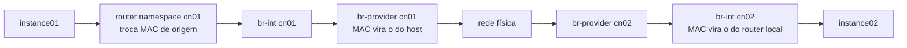

> [!abstract]
> Padrão em que a função de roteamento é replicada em cada nó de computação, em vez de concentrada num nó de rede central.

## Conceito

No modelo centralizado, todo tráfego roteado atravessa o nó de rede — mesmo quando origem e destino estão no mesmo data center, no mesmo rack ou no mesmo host. Isso cria dois problemas: **gargalo de banda** e **ponto único de falha**.

O DVR replica o roteador em cada compute. O **mesmo namespace de roteador, com as mesmas interfaces e os mesmos IPs**, existe em todos os nós. Cada um roteia localmente o que lhe diz respeito.

## Características

Impacto nos dois padrões de tráfego:

| Tráfego | Centralizado | DVR |
|---|---|---|
| **Leste-oeste** (instância ↔ instância) | Sobe ao nó de rede e volta | Roteado direto entre os computes |
| **Norte-sul** (com floating IP) | Passa pelo nó de rede | Sai direto do compute |

Requer agente L3 em cada nó de computação e, no OpenStack, o mechanism driver [[Open vSwitch (OVS)]].

## Exemplo — caminho leste-oeste

## Comparação

| | [[VRRP]] | DVR |
|---|---|---|
| Objetivo | Disponibilidade do roteador | Distribuição da carga de roteamento |
| Onde roda o agente L3 | Nós de rede | Nós de computação |
| Resolve | Falha do roteador ativo | Gargalo e latência do nó central |
| Complexidade | Menor | Maior |

Não são excludentes — resolvem problemas diferentes da mesma camada.

## Veja também

- [[Neutron]]
- [[VRRP]]
- [[Open vSwitch (OVS)]]
- [[Floating IP]]
