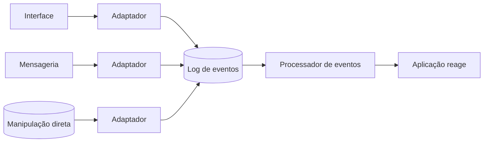

> [!abstract]
> Domain Event captura a memória de algo interessante que aconteceu e que afeta o domínio — o registro de um estímulo que pode disparar uma mudança de estado no sistema.

## Conceito

Coisas acontecem. Nem todas são interessantes; algumas valem registro mas não provocam reação; as mais interessantes causam uma reação. Muitos sistemas precisam reagir a acontecimentos, e frequentemente é preciso saber **por que** o sistema reagiu como reagiu.

Canalizar as entradas do sistema para fluxos de Domain Events permite guardar o registro de tudo que entrou, organizar a lógica de processamento e manter um log de auditoria.

A primeira camada não toma nenhuma ação além de criar e registrar o evento. A segunda pode ignorar completamente qual era a origem — ela só reage ao evento.

## Anatomia de um evento

| Dado | Natureza |
|---|---|
| **Source data** | O que o evento é. Valor da cobrança, fornecedor, etc. **Imutável** |
| **Processing data** | O que o sistema fez em resposta. Em qual fatura apareceu, etc. Mutável |

> [!important] Dois instantes, não um
> Todo evento tem potencialmente **duas marcas de tempo**: quando ocorreu no mundo e quando foi notado pelo sistema. Jantar pago no cartão na terça, com o sistema manual do restaurante transmitindo a transação só na sexta: `occurred = terça`, `noticed = sexta`.
>
> O perigo não é escolher uma só — é escolher sem deixar claro qual foi escolhida. O nome do campo deve dizer qual das duas ele é.

## Corrigindo o passado

O source data nunca muda. Quando o evento original estava errado, a correção entra como um **Retroactive Event** separado, e o processador desfaz as consequências do evento equivocado. O log de auditoria permanece íntegro: registra tanto o erro quanto a correção.

## Quando usar

> [!warning]
> Capturar estímulos como Domain Events é uma decisão arquitetural significativa. Impõe um estilo e um modelo de programação que parecem desajeitados, ao menos no início.

Os ganhos que justificam:

- **Log de auditoria completo** — se o sistema chegou a um estado estranho, existe o registro completo de tudo que o levou até lá
- **Substituição futura** — um roteador de mensagens desvia eventos para um sistema novo, tornando a aposentadoria viável
- **Pré-requisito de [[Event Sourcing]]**, que organiza o sistema para que *todas* as atualizações passem por Domain Events

## Fonte

- Martin Fowler, [Domain Event](https://martinfowler.com/eaaDev/DomainEvent.html), 2005

## Veja também

- [[Event Sourcing]]
- [[Event Driven Architecture]]
- [[CQRS]]
- [[Outbox Pattern]]
- [[Domain Driven Design]]
- [[Saga]]
- [[System Design MOC]]
