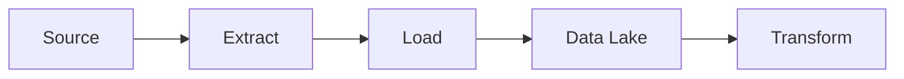

ELT é uma abordagem em que os dados são carregados primeiro no ambiente analítico e transformados posteriormente.

> [!tip]
> ELT tornou-se popular com Data Lakes e plataformas analíticas em nuvem.

## Benefícios

- Escalabilidade
- Flexibilidade
- Processamento distribuído

## Veja também

- [[Data Pipeline]]
- [[ETL]]
- [[Data Lake]]
- [[Data Warehouse]]