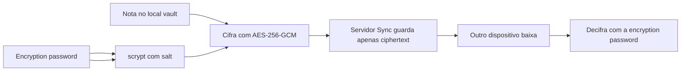

> [!abstract]
> **End-to-end encryption** é o modo padrão do [[Obsidian Sync]] em que os dados são cifrados no momento em que deixam o dispositivo e só podem ser decifrados com a sua encryption password de volta em um dispositivo seu.

## Conceito

O Obsidian implementa AES-256 em modo **GCM** — Galois/Counter Mode — com **scrypt com salt** como key derivation function. A escolha é convencional e verificável; o que muda tudo é *onde a chave vive*.

No E2EE, a chave deriva de uma senha que existe apenas na sua cabeça e nos seus dispositivos. Na **standard encryption**, a chave é gerada pelo app e **armazenada nos servidores da empresa**. Esse é exatamente o modelo do Google Docs, do Dropbox e do iCloud sem Advanced Data Protection — e o próprio texto reconhece o que isso implica: a chave pode ser usada para decifrar seus dados, por exemplo diante de um mandado de busca, ou quando você quer acessar os dados por um navegador.

> [!quote] What does end-to-end encryption mean?
> "End-to-end encryption means that the data is encrypted from the moment it leaves your device, and can only be decrypted using your encryption key once it's back on one of your devices. We can't read your data. Neither can any potential eavesdroppers, such as your internet service provider."

A simetria brutal do E2EE é que a garantia e o risco são a mesma propriedade: se ninguém além de você pode ler, então perder a senha torna os dados **encrypted and unusable forever**. O Obsidian não recupera a senha nem os dados. A senha não fica salva em lugar nenhum. Ver [[Criptografia Simétrica e Assimétrica]].

A encryption password é **separada da senha da conta** Obsidian e **pode ser diferente para cada vault**. Em [[Remote Vault|remote vaults]] compartilhados, cada colaborador precisa digitá-la ao configurar o vault.

## Fluxo

## O que NÃO é end-to-end criptografado

Esta é a parte que quase nunca aparece nas comparações de produto, e o Obsidian a documenta abertamente:

> [!quote] No cryptographic binding between path and content
> "Some metadata is not end-to-end encrypted: which device uploaded or deleted a file, when it was uploaded, and the *mapping* between encrypted file paths and encrypted content. This data is readable by the server so it can route changes, determine the version history for a file, and keep devices in sync."

Ou seja: o metadado existe em claro **porque o serviço precisa dele para funcionar** — rotear mudanças, montar o [[Version History|version history]] de um arquivo, manter os dispositivos coerentes. O risco reconhecido é que um servidor comprometido poderia adulterar esse mapeamento e entregar o conteúdo cifrado de um arquivo sob outro caminho. O plaintext não vaza; a integridade da associação, sim.

O segundo trade-off é o **hash determinístico**: o mesmo conteúdo, com a mesma chave e o mesmo salt, sempre produz o mesmo hash cifrado no servidor. Isso permite deduplicação — não reenviar nem re-armazenar dados idênticos, o que economiza banda e storage especialmente no version history e em arquivos grandes repetidos. O risco admitido: um atacante que comprometesse o servidor *e* tivesse um jeito de forçar você a subir arquivos escolhidos por ele poderia descobrir se um arquivo específico já estava no seu vault. É um caso clássico para [[Threat Modeling]] — o ataque exige duas capacidades simultâneas, não uma.

## Verificação e auditoria

- O Obsidian publica um guia para **verificar de forma trustless** a criptografia fim a fim dos dados enviados e recebidos pelos servidores de Sync — a garantia não pede que você acredite na palavra da empresa, o que é o espírito de [[Zero Trust]]
- Auditorias independentes por firmas de segurança de terceiros são publicadas na página de Security

## Comparação

| | End-to-end encryption | Standard encryption |
|---|---|---|
| Padrão | **Sim** | Não |
| Onde vive a chave | Derivada da sua senha, só nos seus dispositivos | **Gerada pelo app e guardada nos servidores** |
| Obsidian consegue ler | Nunca | Sim, se necessário |
| Modelo equivalente | — | Google Docs, Dropbox, iCloud sem ADP |
| Perder a senha | Dados inutilizáveis para sempre | Não se aplica |
| Caso de uso legítimo | Qualquer dado que deva permanecer privado | Vault que já é público, por exemplo publicado via [[Obsidian Publish]] |
| Em caso de breach total do servidor | Dados seguem cifrados | Chave também está lá |

## Veja também

- [[Obsidian Sync]]
- [[Remote Vault]]
- [[Criptografia Simétrica e Assimétrica]]
- [[Zero Trust]]
- [[Threat Modeling]]
