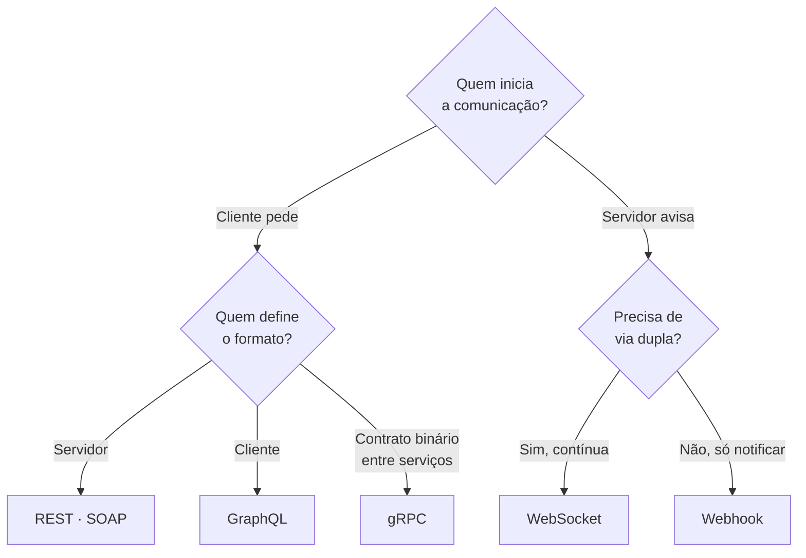

> [!abstract]
> Estilos de arquitetura de API definem **como os componentes de uma API interagem entre si**. Não existe o melhor: existe o que casa com a natureza da interação.

## Conceito

Cada estilo padroniza a troca de dados de um jeito, e essa padronização é o que garante eficiência, confiabilidade e facilidade de integração. Escolher errado não impede o sistema de funcionar — apenas o obriga a lutar contra o próprio transporte pelo resto da vida.

## Os seis estilos

| Estilo | Características | Melhor para |
|---|---|---|
| **SOAP** | Maduro, abrangente, baseado em XML | Aplicações corporativas com contrato formal e transações |
| **[[REST API]]** | Popular, fácil de implementar, verbos [[HTTP]] | Serviços web de propósito geral |
| **[[GraphQL]]** | Linguagem de consulta, o cliente pede campos específicos | Reduzir tráfego e número de chamadas em clientes ricos |
| **[[gRPC]]** | Moderno, alto desempenho, Protocol Buffers | Comunicação interna em [[Microservices]] |
| **[[WebSocket]]** | Tempo real, bidirecional, conexão persistente | Troca de baixa latência e push do servidor |
| **[[Webhook]]** | Orientado a evento, callback HTTP, assíncrono | Notificar outro sistema quando algo acontece |

## Como escolher

> [!tip] Os estilos convivem
> Uma arquitetura madura raramente usa um só: REST na borda pública, gRPC entre serviços internos, WebSocket para o painel ao vivo e Webhook para notificar parceiros. O [[API Gateway]] costuma ser o ponto onde essa tradução acontece.

> [!important] O eixo que realmente separa
> Não é o formato do payload — é **quem inicia** e **quem define o formato da resposta**. Duas perguntas que a documentação de cada estilo raramente coloca lado a lado, mas que decidem a escolha.

## Fonte

- ByteByteGo, [How many API architecture styles do you know?](https://blog.postman.com/api-protocols-in-2023/) — *BIG ARCHIVE: System Design 2023*

## Veja também

- [[REST API]]
- [[GraphQL]]
- [[gRPC]]
- [[WebSocket]]
- [[Webhook]]
- [[API Gateway]]
- [[System Design MOC]]
